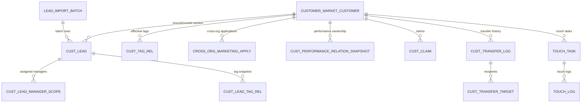

# 客户营销中心 — 表结构 DDL

> 本文档仅描述 `customer-marketing-center` 已在目标库核实的数据模型，不是可执行 DDL 或迁移脚本。
> 结构变更由 DBA 按审批结果直接实施，历史 `docs/schema` 与 `docs/superpowers/sql` 文件不能作为当前投产依据。
>
> V2 当前范围已扩展至客户标签管理/审核、跨机构营销和客户转交记录。输入来源为 `V2_DEMO/01_需求说明书_公司部_V1.2.docx`、`03_功能需求与业务设计.md`、对应 Vue 页面及 `0811-客户营销-会议纪要.docx`；存在冲突时，以会议纪要为准。

## 1. 第一阶段设计结论

1. 不新增后端模块，直接扩展现有 `customer-marketing-center`。
2. V2 以统一社会信用代码作为客户幂等标识；客户名称只用于展示和模糊检索，不再强唯一。
3. `CUSTOMER_MARKET_CUSTOMER.cust_no` 允许为空。客户列表返回数据权限范围内全部 `deleted=0` 客户，不以是否开户或客户号是否为空进行排除。
4. 主办客户经理和主办机构落在 `CUSTOMER_MARKET_CUSTOMER`，用于客户经理/机构负责人数据范围过滤；`owner_org_id` 仍只是数据来源属性。
5. 存量 `CUST_MASTER` 只承接 `XAN_M98_CUST_STAT_SHOW3` 的 T-1 客户同步及绩效等存量业务查询，不再承载客户营销数据。
6. 线索的指定客户经理范围和标签均改为关系表。`assigned_to`/`tag_ids` 仅保留为旧版兼容字段，新实现不再以其为数据真相。
7. 线索审批不新建 `CUST_LEAD_APPROVAL` 表。业务状态和最终决策快照落在 `CUST_LEAD`/`LEAD_IMPORT_BATCH`，流程映射与完整节点历史仍由 `BIZ_PROCESS_MAP` 及 Flowable `ACT_*` 表管理。
8. 附件正文不进业务表，通过 `FileApi` 写入现有 `FILE_OBJECT`/`BIZ_FILE_REL`，`biz_type=LEAD`、`biz_id=CUST_LEAD.id`。

## 2. 表清单

| 表名 | 变更 | 主要用途 |
|---|---|---|
| `CUST_TAG` | 扩展 | 客户标签主数据与审核结果 |
| `CUST_TAG_REL` | 扩展 | 当前及历史客户标签关系 |
| `CROSS_ORG_MARKETING_RULE` | 新增 | 跨机构营销四项在线校验规则 |
| `CROSS_ORG_MARKETING_APPLY` | 新增 | 跨机构营销申请、审核结果和任务投影 |
| `CUST_LEAD` | 扩展 | 线索版本、表单快照、分配方式、审批结果 |
| `CUST_LEAD_MANAGER_SCOPE` | 新增 | 指定客户经理范围/主办专属接收人 |
| `CUST_LEAD_TAG_REL` | 新增 | 线索提交时的标签关系和名称快照 |
| `LEAD_IMPORT_BATCH` | 扩展 | Excel 整批校验、整批审批、错误文件 |
| `CUST_MASTER` | 收敛 | 仅承接 M98 T-1 客户号/名称同步及存量业务查询 |
| `CUSTOMER_MARKET_CUSTOMER` | 新增 | 客户营销列表、主办关系、开户与最近触达快照 |
| `CUST_PERFORMANCE_RELATION_SNAPSHOT` | 新增 | 客户业绩相关人/归属的日快照 |
| `CUST_CLAIM` | 保留 | 机构认领和维护人关系 |
| `CUST_TRANSFER_LOG` | 新增 | 客户主办/维护关系转交留痕 |
| `CUST_TRANSFER_TARGET` | 新增 | 转交的主办与协办接收人 |
| `TOUCH_TASK` | 保留 | 触达任务 |
| `TOUCH_LOG` | 保留 | 触达日志 |

## 3. 关系模型



> 项目不使用物理外键。上图均为逻辑外键，完整性由 Service 事务和唯一索引保证。

## 4. 核心表设计

### 4.1 `CUST_LEAD`

`CUST_LEAD` 仍采用“一个版本一行”。修改已通过线索时创建新 `id`，通过 `prev_lead_id` 连接上一版，旧版 `is_latest=0`。

| 字段组 | 核心字段 | 说明 |
|---|---|---|
| 版本 | `lead_no`, `lead_op`, `prev_lead_id`, `version_no`, `is_latest` | 保留现有版本链 |
| 场景 | `lead_type` | `NEW_ACCOUNT` / `EXISTING_MARKETING` |
| 身份 | `cust_no`, `cust_name`, `unified_credit_code` | 统一社会信用代码必填，校验 18 位数字或大写字母 |
| 经营 | `industry`, `group_type`, `group_name`, `customer_type`, `is_keystone`, `enterprise_type` | 下拉项由 `DictApi` 校验 |
| 财务 | `credit_amount`, `credit_exposure_amount` | 库内统一存“元”，前端以“万元”展示时在 DTO 层转换 |
| 分配 | `distribution_mode`, `main_manager_id`, `main_manager_org_id` | `PUBLIC` / `SCOPE` / `OWNER` |
| 批量 | `import_batch_id`, `batch_row_no` | 可还原源 Excel 行 |
| 审批 | `submitted_by/time`, `business_key`, `process_instance_id`, `reviewed_by/time`, `reject_reason` | 仅保存业务投影和最终决策 |
| 并发 | `lock_version` | 提交时仍需 `SELECT ... FOR UPDATE` |

主要约束：

- `uk_lead_active_new_credit_code` 基于生成列 `active_new_credit_code`，保证同一统一社会信用代码只有一条最新的“新客户开户线索”。存量客户营销线索可正常复用客户代码。
- `uk_lead_business_key` 和 `uk_lead_process_instance` 防止同一版本重复绑定流程。
- `idx_lead_entry_list` 服务于“我的录入”；`idx_lead_approval_list` 服务于“待审批/审批记录”。

### 4.2 `CUST_LEAD_MANAGER_SCOPE`

- `PUBLIC` 方式不产生关系行。
- `SCOPE` 至少一行，可多人，`assignment_type=SCOPE`。
- `OWNER` 必须且只能一行，`assignment_type=OWNER` 且 `is_primary=1`；人员必须来自后端主办权查询，不接受前端自由输入。
- 唯一键 `(lead_id, manager_emp_id)` 防止重复指定；`idx_manager_visible_leads` 支持指定范围客户池的可见性查询。

### 4.3 `CUST_LEAD_TAG_REL`

线索每个版本独立保存标签关系，并写入 `tag_name_snapshot`，确保审批历史不受后续标签改名影响。提交时必须通过 `TagApi` 验证标签处于已审批且有效状态。

### 4.4 `LEAD_IMPORT_BATCH`

| 状态 | 含义 | 允许后续动作 |
|---|---|---|
| `CREATED` | 已创建批次头，整批校验通过 | 提交审批 |
| `VALIDATION_FAILED` | 至少一行错误，未写入任何 `CUST_LEAD` | 下载错误明细；修正后新建批次 |
| `PENDING_APPROVAL` | 已写入全部行级线索，且共用一个批次流程 | 整批通过/整批退回 |
| `APPROVED` | 整批通过，终态 | 只读 |
| `REJECTED` | 整批退回，终态 | 只读；需重新导入新批次 |

批次业务键固定为 `LEAD:IMP_{batchId}`。行级线索不各自启动流程，审批回调在一个事务内统一更新批次和所有行状态。

### 4.5 `CUSTOMER_MARKET_CUSTOMER`

V2 新增的客户列表核心字段：

| 字段 | 说明 |
|---|---|
| `current_lead_id` | 当前生效的审批通过线索版本 |
| `main_manager_id`, `main_org_id` | 当前主办客户经理和机构，是客户列表数据范围依据 |
| `ownership_status` | `UNASSIGNED` / `ASSIGNED` / `WAITING_CLAIM` / `MULTI_CLAIMED` |
| `last_touch_time` | 最近有效触达的列表快照，触达日志仍是详细真相 |
| `source_system`, `source_updated_time` | CCRM/YB0/CW35/本地数据的溯源信息；M98 的 `statis_dt` 仅保留在 `CUST_MASTER` |
| `lock_version` | 主办变更和同步冲突的乐观锁 |

唯一性口径：

- `cust_no` 非空时全局唯一，允许多个未开户客户为 `NULL`。
- `unified_credit_code` 非空时全局唯一；为兼容现有 CCRM 历史数据，主档中允许暂时为 `NULL`。
- `cust_name` 不唯一，保留普通索引。

列表关键查询：

```sql
-- 客户经理视角
SELECT *
  FROM CUSTOMER_MARKET_CUSTOMER
 WHERE deleted = 0
   AND (
       main_manager_id = :currentEmpId
       OR EXISTS (
           SELECT 1 FROM CUST_CLAIM cc
            WHERE cc.cust_id = CUSTOMER_MARKET_CUSTOMER.id
              AND cc.claim_status = 'CLAIMED'
              AND cc.maintainer_emp_id = :currentEmpId
       )
   )
 ORDER BY updated_time DESC;

-- 机构负责人视角（下属机构码由 OrgApi 展开）
SELECT *
  FROM CUSTOMER_MARKET_CUSTOMER
 WHERE deleted = 0
   AND (
       main_org_id IN (:orgCodes)
       OR EXISTS (
           SELECT 1 FROM CUST_CLAIM cc
            WHERE cc.cust_id = CUSTOMER_MARKET_CUSTOMER.id
              AND cc.claim_status = 'CLAIMED'
              AND cc.org_id IN (:orgCodes)
       )
   )
 ORDER BY updated_time DESC;
```

### 4.6 `CUST_PERFORMANCE_RELATION_SNAPSHOT`

该表是客户列表的查询快照，不是权限表。`subject_type + subject_id` 统一表示人员或机构归属，`source_batch_id` 保留每次抽取版本。仅有业绩关系的人员不因此获得客户详情、触达或资产投放权限。

### 4.7 `CUST_TRANSFER_LOG` / `CUST_TRANSFER_TARGET`

- 转交主表保存原主办、新主办、原因、开户状态快照和执行结果。
- 接收人表支持前端“首位为新主办，其余为协办”的多人转交。
- 实际转交在同一事务内保存转交快照、关闭原进行中触达任务、更新 `CUSTOMER_MARKET_CUSTOMER` 主办关系并为新主办创建首次触达任务；本阶段不自动改写业绩归属快照。
- 转交是高危操作，除业务表留痕外还必须写平台 `AUDIT_LOG`。

### 4.8 `CUST_CLAIM` / `TOUCH_TASK` / `TOUCH_LOG`

- `CUST_CLAIM` 唯一键调整为 `uk_cust_claim_emp(cust_id, claimed_by)`：同一员工不能重复认领，同一客户可被不同员工分别认领。认领只建立关系，不自动创建任务。
- `TOUCH_TASK` 新建任务的 SLA 初始值为 `BLUE`，预警为 `YELLOW`，逾期为 `RED`；历史 `GREEN` 仅兼容读取。进行中任务按 `(cust_id, assignee_emp_id, task_status)` 进行员工维度防重。
- `TOUCH_LOG` 在原有日志内容、幂等键和照片 URL 基础上新增 `touch_method`、`participant_emp_ids`、`photo_groups`、`operator_location`。后三个结构化字段按 JSON 字符串保存。
- 分类照片包含关键人合影、企业门牌、经营场所，每类最多 3 张且每次记录至少 1 张；任务执行人可写，同机构可读，系统管理员可读全量，跨机构隔离。

### 4.9 `CROSS_ORG_MARKETING_RULE` / `CROSS_ORG_MARKETING_APPLY`

- 规则表初始化四条冻结口径，`enabled` 可控制是否参与在线校验；无启用配置时服务使用同样的内置安全默认值。
- 申请表保存客户、申请人、原主办快照、四项校验结果、审核结果和自动生成的触达任务 ID。
- 审核通过只生成申请人的触达任务，不更新 `CUSTOMER_MARKET_CUSTOMER` 主办关系，也不授予客户资产权限。

## 5. 线索审批存储边界

| 数据 | 真实来源 |
|---|---|
| 线索/批次当前业务状态 | `CUST_LEAD.lead_status` / `LEAD_IMPORT_BATCH.status` |
| 最终通过人、时间、退回原因 | 两张业务表的 `reviewed_*` / `reject_reason` 快照 |
| 业务与流程映射 | `BIZ_PROCESS_MAP` |
| 当前待办、节点候选人 | Flowable `ACT_RU_*` |
| 完整已办、节点意见、转交历史 | Flowable `ACT_HI_*` + `WorkflowQueryApi` |
| 高危操作审计 | `AUDIT_LOG` |

模块禁止直接查询 Flowable 表，必须通过 `WorkflowApi` / `WorkflowQueryApi` 访问。同时不建立另一张通用审批表，否则容易与 Flowable 历史产生状态漂移。

## 6. 关键事务与并发约束

1. **单条提交**：锁定 `CUST_LEAD`，校验 `DRAFT`，写 `SUBMITTED`，启动 `LEAD:{leadId}` 流程，再写 `IN_APPROVAL`。
2. **整批导入**：文件所有行校验通过后，一个事务写入批次和所有线索行；任一行错误时只保留 `VALIDATION_FAILED` 批次头和错误文件。
3. **最终回调**：依赖 `process_instance_id` 和业务当前状态幂等更新；重复回调不得重复生成客户、客户池或触达任务。
4. **版本切换**：旧版 `is_latest=0` 和新版插入必须同事务；新版复制标签、分配范围和附件关系，不修改历史版本。
5. **客户转交**：锁定客户和当前有效认领关系，用 `lock_version` 防止同步任务覆盖主办变更。
6. **认领与首次触达**：认领关系和手动创建首次任务为两个独立事务入口；`OWNER` 线索审批回调是唯一自动建认领和首次任务的入口，并依赖认领/任务防重查询保证回调幂等。

## 7. 兼容与后续实现清单

- 本阶段已落地客户列表数据范围、线索单条录入/详情/主办查询、审批待办已办/详情/全量已处理 Excel 导出，以及待认领池、我的客户、首次/再次触达、触达记录和机构管理视图。
- Excel 批量导入按 2026-08-11 会议纪要归入后续阶段；`LEAD_IMPORT_BATCH` 扩展仅作已预留的数据模型，不表示本期已交付完整导入流程。
- 需将 `CustMasterAssemblerService` 的本地占位客户号改为：未开户客户 `cust_no=NULL`，开户后以 CCRM/CW35 回传客户号为准。
- 新写入同时维护关系表和旧兼容字段；完成数据回填、双读校验后，再单独评估删除 `tag_ids` / `assigned_to` / `lead_id`。
- 所有新 Mapper 必须继承 MyBatis-Plus `BaseMapper<T>`，单表 CRUD 不新写 XML。
