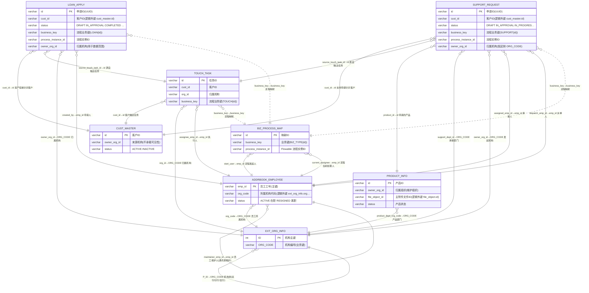
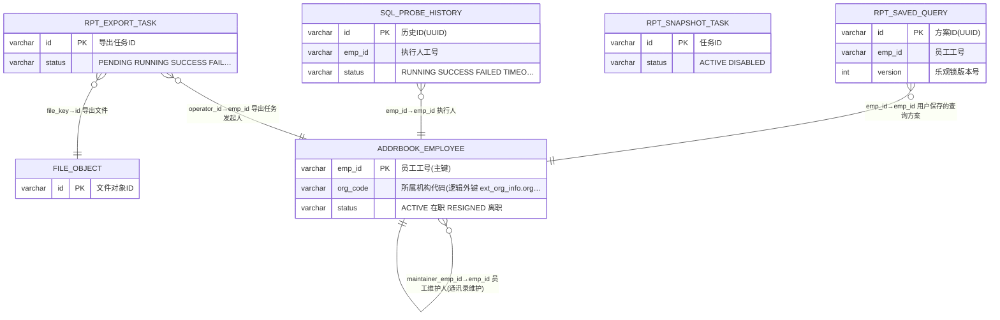

# yiti 数据表关联图(Mermaid)

> 来源: 项目 `docs/schema/ddl-*.sql`(跳过 Quartz)。每个箭头后面的标签格式为 `源列→目标列  业务说明`。`}o..||` 虚线表示通过约定列(如 `business_key` 或 `version`)做的逻辑关联,无 FK 约束。

### 一、跨模块业务总览(精简实体)

```mermaid
erDiagram
  PT_USER {
    varchar USER_ID PK "用户ID(工号)"
  }
  EXT_ORG_INFO {
    int ID PK "机构主键"
    varchar ORG_CODE "机构编号(业务键)"
  }
  FILE_OBJECT {
    varchar id PK "文件对象ID"
  }
  BIZ_FILE_REL {
    varchar id PK "关联ID"
    varchar file_object_id "文件对象ID(逻辑外键 file_object.id)"
  }
  BIZ_PROCESS_MAP {
    varchar id PK "映射ID"
    varchar business_key "业务键(BIZ_TYPE{id})"
    varchar process_instance_id "Flowable 流程实例ID"
  }
  ADDRBOOK_EMPLOYEE {
    varchar emp_id PK "员工工号(主键)"
    varchar org_code "所属机构代码(逻辑外键 ext_org_info.org…"
    varchar status "ACTIVE 在职   RESIGNED 离职"
  }
  PRODUCT_INFO {
    varchar id PK "产品ID"
    varchar owner_org_id "归属组织(维护组织)"
    varchar file_object_id "主附件文件ID(逻辑外键 file_object.id)"
    varchar status "产品状态"
  }
  CUST_LEAD {
    varchar id PK "线索ID"
    varchar owner_org_id "归属机构代码"
    varchar business_key "流程业务键(LEAD{id})"
    varchar process_instance_id "Flowable 流程实例ID"
  }
  CUST_MASTER {
    varchar id PK "客户ID"
    varchar owner_org_id "来源机构(不承载可见性)"
    varchar status "ACTIVE INACTIVE"
  }
  CUST_CLAIM {
    varchar id PK "认领ID"
    varchar cust_id "客户ID"
    varchar org_id "认领机构代码"
  }
  TOUCH_TASK {
    varchar id PK "任务ID"
    varchar cust_id "客户ID"
    varchar org_id "归属机构"
    varchar business_key "流程业务键(TOUCH{id})"
  }
  TOUCH_LOG {
    varchar id PK "日志ID"
    varchar owner_org_id "归属机构"
  }
  LOAN_APPLY {
    varchar id PK "申请ID(UUID)"
    varchar cust_id "客户ID(逻辑外键 cust_master.id)"
    varchar status "DRAFT IN_APPROVAL COMPLETED …"
    varchar business_key "流程业务键(LOAN{id})"
    varchar process_instance_id "流程实例ID"
    varchar owner_org_id "归属机构(用于数据范围)"
  }
  SUPPORT_REQUEST {
    varchar id PK "申请ID(UUID)"
    varchar cust_id "客户ID(逻辑外键 cust_master.id)"
    varchar status "DRAFT IN_APPROVAL IN_PROGRES…"
    varchar business_key "流程业务键(SUPPORT{id})"
    varchar process_instance_id "流程实例ID"
    varchar owner_org_id "归属机构(发起侧 ORG_CODE)"
  }
  SYS_CONTROL {
    varchar id PK "控制ID"
    varchar scope_dim "EMP ORG CUST"
    varchar current_version "当前有效版本"
  }
  PERF_METRIC_DEF {
    varchar id PK "指标ID"
    varchar metric_code "指标编码(唯一)"
    varchar base_dim "基础维度 EMP ORG CUST"
    int val_slot "宽表槽位 1..200(同维度+slot 唯一)"
    varchar status "ACTIVE DISABLED"
  }
  PERF_KPI_SCHEME {
    varchar id PK "方案ID"
    varchar status "ACTIVE DISABLED"
  }
  PERF_KPI_ITEM {
    varchar id PK "项ID"
    varchar scheme_id "方案ID(逻辑外键 perf_kpi_scheme.id…"
    varchar metric_code "指标编码(人员维度)"
  }
  PERF_TARGET_PLAN {
    varchar id PK "目标方案ID"
    varchar status "ACTIVE DISABLED"
    varchar owner_emp_id "归属员工(SELF SELF_ASSIGNED)"
    varchar owner_org_code "归属机构(ORG ORG_SUBTREE)"
  }
  PERF_TARGET_VALUE {
    varchar id PK "目标值ID"
    varchar plan_id "目标方案ID(逻辑外键 perf_target_plan…"
    varchar subject_id "对象ID(emp_id org_code)"
    varchar metric_code "指标编码"
    varchar owner_emp_id "归属员工"
    varchar owner_org_code "归属机构"
  }
  EMP_INDEX_RESULT {
    bigint id PK "主键"
    date data_date "数据日期"
    varchar version "数据版本(关联 sys_control.current_…"
    varchar emp_id "员工工号(逻辑外键 addrbook_employee.…"
  }
  ORG_INDEX_RESULT {
    bigint id PK "主键"
    date data_date "数据日期"
    varchar version "数据版本"
    varchar org_code "机构编码(逻辑外键 ext_org_info.org_c…"
  }
  CUST_INDEX_RESULT {
    bigint id PK "主键"
    date data_date "数据日期"
    varchar version "数据版本"
    varchar cust_id "客户ID(逻辑外键 cust_master.id)"
  }
  KPI_RESULT {
    bigint id PK "主键"
    varchar emp_id "员工工号"
    varchar data_version "指标数据版本"
  }
  CUST_ALLOC_RELATION {
    varchar id PK "主键ID"
    varchar cust_id "客户ID(逻辑外键 cust_master.id)"
    varchar emp_id "员工工号"
  }
  RPT_SAVED_QUERY {
    varchar id PK "方案ID(UUID)"
    varchar emp_id "员工工号"
    int version "乐观锁版本号"
  }
  RPT_EXPORT_TASK {
    varchar id PK "导出任务ID"
    varchar status "PENDING RUNNING SUCCESS FAIL…"
  }
  EXT_ORG_INFO }o--|| EXT_ORG_INFO : "P_ID→ORG_CODE 机构树(总行/分行/支行)"
  ADDRBOOK_EMPLOYEE ||--|| PT_USER : "emp_id→USER_ID 通讯录与登录用户共用工号"
  ADDRBOOK_EMPLOYEE }o--|| EXT_ORG_INFO : "org_code→ORG_CODE 员工所属机构"
  ADDRBOOK_EMPLOYEE }o--|| ADDRBOOK_EMPLOYEE : "maintainer_emp_id→emp_id 员工维护人(通讯录维护)"
  PRODUCT_INFO }o--|| FILE_OBJECT : "file_object_id→id 产品主附件"
  PRODUCT_INFO }o--|| EXT_ORG_INFO : "product_dept_org_code→ORG_CODE 产品部门"
  BIZ_FILE_REL }o--|| FILE_OBJECT : "file_object_id→id 业务实体的附件"
  BIZ_PROCESS_MAP }o--|| ADDRBOOK_EMPLOYEE : "start_user→emp_id 流程发起人"
  BIZ_PROCESS_MAP }o--|| ADDRBOOK_EMPLOYEE : "current_assignee→emp_id 流程当前处理人"
  CUST_LEAD }o--|| CUST_MASTER : "source_cust_id→id 线索关联的客户(UPDATE/DELETE)"
  CUST_LEAD }o--|| CUST_LEAD : "prev_lead_id→id 线索版本链"
  CUST_LEAD }o--|| EXT_ORG_INFO : "owner_org_id→ORG_CODE 线索归属机构"
  CUST_MASTER ||--|| CUST_LEAD : "lead_id→id 客户来源线索(转客)"
  CUST_CLAIM }o--|| CUST_MASTER : "cust_id→id 客户被认领"
  CUST_CLAIM }o--|| EXT_ORG_INFO : "org_id→ORG_CODE 认领机构"
  CUST_CLAIM }o--|| ADDRBOOK_EMPLOYEE : "claimed_by→emp_id 认领人"
  CUST_CLAIM }o--|| ADDRBOOK_EMPLOYEE : "maintainer_emp_id→emp_id 维护人"
  TOUCH_TASK }o--|| CUST_MASTER : "cust_id→id 客户触达任务"
  TOUCH_TASK }o--|| EXT_ORG_INFO : "org_id→ORG_CODE 归属机构"
  TOUCH_TASK }o--|| ADDRBOOK_EMPLOYEE : "assignee_emp_id→emp_id 执行人"
  TOUCH_LOG }o--|| TOUCH_TASK : "touch_task_id→id 任务的日志"
  LOAN_APPLY }o--|| CUST_MASTER : "cust_id→id 资产投放针对客户"
  LOAN_APPLY }o--|| TOUCH_TASK : "source_touch_task_id→id 源自触达任务"
  LOAN_APPLY }o--|| EXT_ORG_INFO : "owner_org_id→ORG_CODE 归属机构"
  LOAN_APPLY }o--|| ADDRBOOK_EMPLOYEE : "created_by→emp_id 申请人"
  SUPPORT_REQUEST }o--|| CUST_MASTER : "cust_id→id 支持申请针对客户"
  SUPPORT_REQUEST }o--|| TOUCH_TASK : "source_touch_task_id→id 源自触达任务"
  SUPPORT_REQUEST }o--|| PRODUCT_INFO : "product_id→id 申请的产品"
  SUPPORT_REQUEST }o--|| EXT_ORG_INFO : "support_dept_id→ORG_CODE 承接部门"
  SUPPORT_REQUEST }o--|| EXT_ORG_INFO : "owner_org_id→ORG_CODE 发起机构"
  SUPPORT_REQUEST }o--|| ADDRBOOK_EMPLOYEE : "assigned_emp_id→emp_id 承接人"
  SUPPORT_REQUEST }o--|| ADDRBOOK_EMPLOYEE : "dispatch_emp_id→emp_id 派单人"
  LOAN_APPLY }o..|| BIZ_PROCESS_MAP : "business_key→business_key 流程映射"
  SUPPORT_REQUEST }o..|| BIZ_PROCESS_MAP : "business_key→business_key 流程映射"
  CUST_LEAD }o..|| BIZ_PROCESS_MAP : "business_key→business_key 流程映射"
  TOUCH_TASK }o..|| BIZ_PROCESS_MAP : "business_key→business_key 流程映射"
  PERF_KPI_ITEM }o--|| PERF_KPI_SCHEME : "scheme_id→id KPI 方案的项"
  PERF_KPI_ITEM }o--|| PERF_METRIC_DEF : "metric_code→metric_code KPI 项的指标"
  PERF_TARGET_PLAN }o--|| PERF_KPI_SCHEME : "kpi_scheme_id→id 目标方案绑定 KPI"
  PERF_TARGET_VALUE }o--|| PERF_TARGET_PLAN : "plan_id→id 目标方案下的值"
  PERF_TARGET_VALUE }o--|| PERF_METRIC_DEF : "metric_code→metric_code 目标针对的指标"
  EMP_INDEX_RESULT }o--|| ADDRBOOK_EMPLOYEE : "emp_id→emp_id 员工指标值"
  EMP_INDEX_RESULT }o..|| SYS_CONTROL : "version→current_version 数据版本对齐"
  ORG_INDEX_RESULT }o--|| EXT_ORG_INFO : "org_code→ORG_CODE 机构指标值"
  ORG_INDEX_RESULT }o..|| SYS_CONTROL : "version→current_version 数据版本对齐"
  CUST_INDEX_RESULT }o--|| CUST_MASTER : "cust_id→id 客户指标值"
  CUST_INDEX_RESULT }o..|| SYS_CONTROL : "version→current_version 数据版本对齐"
  KPI_RESULT }o--|| ADDRBOOK_EMPLOYEE : "emp_id→emp_id 员工 KPI 结果"
  KPI_RESULT }o..|| SYS_CONTROL : "data_version→current_version 数据版本对齐"
  CUST_ALLOC_RELATION }o--|| CUST_MASTER : "cust_id→id 客户分配关系的客户"
  CUST_ALLOC_RELATION }o--|| ADDRBOOK_EMPLOYEE : "emp_id→emp_id 客户分配关系的员工"
  RPT_SAVED_QUERY }o--|| ADDRBOOK_EMPLOYEE : "emp_id→emp_id 用户保存的查询方案"
  RPT_EXPORT_TASK }o--|| ADDRBOOK_EMPLOYEE : "operator_id→emp_id 导出任务发起人"
  RPT_EXPORT_TASK }o--|| FILE_OBJECT : "file_key→id 导出文件"
```

---

## 二、按模块的完整关联图

### 认证授权中心(auth) — 含跨模块邻居表 11 张

```mermaid
erDiagram
  PT_USER {
    varchar USER_ID PK "用户ID(工号)"
  }
  PT_ROLE {
    varchar ROLE_ID PK "角色ID"
  }
  PT_RESOURCE {
    varchar RESOURCE_ID PK "资源ID"
    int STATUS "0 启用 1 不启用"
  }
  PT_USER_ROLE {
    varchar USER_ID PK "用户ID"
    varchar ROLE_ID PK "角色ID"
  }
  PT_ROLE_RESOURCE {
    varchar ID PK "主键ID"
    varchar ROLE_ID "角色ID"
  }
  PT_ROLE_BIZ_SCOPE {
    varchar ID PK "主键ID"
    varchar ROLE_ID "角色ID"
  }
  EXT_ORG_INFO {
    int ID PK "机构主键"
    varchar ORG_CODE "机构编号(业务键)"
  }
  EXT_USER_ORG {
    varchar USER_ID PK "用户ID"
    varchar ORG_CODE PK "机构编码"
  }
  AUDIT_LOG {
    varchar id PK "日志ID"
    varchar emp_id "操作人工号"
  }
  ADDRBOOK_EMPLOYEE {
    varchar emp_id PK "员工工号(主键)"
    varchar org_code "所属机构代码(逻辑外键 ext_org_info.org…"
    varchar status "ACTIVE 在职   RESIGNED 离职"
  }
  PRODUCT_INFO {
    varchar id PK "产品ID"
    varchar owner_org_id "归属组织(维护组织)"
    varchar file_object_id "主附件文件ID(逻辑外键 file_object.id)"
    varchar status "产品状态"
  }
  CUST_LEAD {
    varchar id PK "线索ID"
    varchar owner_org_id "归属机构代码"
    varchar business_key "流程业务键(LEAD{id})"
    varchar process_instance_id "Flowable 流程实例ID"
  }
  CUST_CLAIM {
    varchar id PK "认领ID"
    varchar cust_id "客户ID"
    varchar org_id "认领机构代码"
  }
  TOUCH_TASK {
    varchar id PK "任务ID"
    varchar cust_id "客户ID"
    varchar org_id "归属机构"
    varchar business_key "流程业务键(TOUCH{id})"
  }
  LOAN_APPLY {
    varchar id PK "申请ID(UUID)"
    varchar cust_id "客户ID(逻辑外键 cust_master.id)"
    varchar status "DRAFT IN_APPROVAL COMPLETED …"
    varchar business_key "流程业务键(LOAN{id})"
    varchar process_instance_id "流程实例ID"
    varchar owner_org_id "归属机构(用于数据范围)"
  }
  SUPPORT_REQUEST {
    varchar id PK "申请ID(UUID)"
    varchar cust_id "客户ID(逻辑外键 cust_master.id)"
    varchar status "DRAFT IN_APPROVAL IN_PROGRES…"
    varchar business_key "流程业务键(SUPPORT{id})"
    varchar process_instance_id "流程实例ID"
    varchar owner_org_id "归属机构(发起侧 ORG_CODE)"
  }
  ORG_INDEX_RESULT {
    bigint id PK "主键"
    date data_date "数据日期"
    varchar version "数据版本"
    varchar org_code "机构编码(逻辑外键 ext_org_info.org_c…"
  }
  PERF_ALLOC_ADJUST_APPLY {
    varchar id PK "申请ID"
    varchar cust_id "客户ID"
    varchar status "DRAFT IN_APPROVAL APPROVED R…"
    varchar business_key "流程业务键"
    varchar process_instance_id "流程实例ID"
    varchar owner_org_id "归属机构"
  }
  PERF_TARGET_ADJUST_APPLY {
    varchar id PK "申请ID"
    varchar plan_id "目标方案ID(逻辑外键 perf_target_plan…"
    varchar subject_id "对象ID"
    varchar status "DRAFT IN_APPROVAL APPROVED R…"
    varchar business_key "流程业务键"
    varchar process_instance_id "流程实例ID"
    varchar owner_org_id "归属机构"
  }
  PT_USER_ROLE }o--|| PT_USER : "USER_ID→USER_ID 用户分配的角色"
  PT_USER_ROLE }o--|| PT_ROLE : "ROLE_ID→ROLE_ID 角色拥有的用户"
  PT_ROLE_RESOURCE }o--|| PT_ROLE : "ROLE_ID→ROLE_ID 角色绑定资源"
  PT_ROLE_RESOURCE }o--|| PT_RESOURCE : "RESOURCE_ID→RESOURCE_ID 资源被角色引用"
  PT_RESOURCE }o--|| PT_RESOURCE : "PARENT_RESOURCE_ID→RESOURCE_ID 菜单/资源树"
  PT_ROLE_BIZ_SCOPE }o--|| PT_ROLE : "ROLE_ID→ROLE_ID 角色×BizType→DataScope"
  EXT_USER_ORG }o--|| PT_USER : "USER_ID→USER_ID 用户归属机构(可多机构)"
  EXT_USER_ORG }o--|| EXT_ORG_INFO : "ORG_CODE→ORG_CODE 机构含有的用户"
  EXT_ORG_INFO }o--|| EXT_ORG_INFO : "P_ID→ORG_CODE 机构树(总行/分行/支行)"
  ADDRBOOK_EMPLOYEE ||--|| PT_USER : "emp_id→USER_ID 通讯录与登录用户共用工号"
  ADDRBOOK_EMPLOYEE }o--|| EXT_ORG_INFO : "org_code→ORG_CODE 员工所属机构"
  ADDRBOOK_EMPLOYEE }o--|| ADDRBOOK_EMPLOYEE : "maintainer_emp_id→emp_id 员工维护人(通讯录维护)"
  PRODUCT_INFO }o--|| EXT_ORG_INFO : "product_dept_org_code→ORG_CODE 产品部门"
  AUDIT_LOG }o--|| PT_USER : "emp_id→USER_ID 审计日志的操作人"
  CUST_LEAD }o--|| CUST_LEAD : "prev_lead_id→id 线索版本链"
  CUST_LEAD }o--|| EXT_ORG_INFO : "owner_org_id→ORG_CODE 线索归属机构"
  CUST_CLAIM }o--|| EXT_ORG_INFO : "org_id→ORG_CODE 认领机构"
  CUST_CLAIM }o--|| ADDRBOOK_EMPLOYEE : "claimed_by→emp_id 认领人"
  CUST_CLAIM }o--|| ADDRBOOK_EMPLOYEE : "maintainer_emp_id→emp_id 维护人"
  TOUCH_TASK }o--|| EXT_ORG_INFO : "org_id→ORG_CODE 归属机构"
  TOUCH_TASK }o--|| ADDRBOOK_EMPLOYEE : "assignee_emp_id→emp_id 执行人"
  LOAN_APPLY }o--|| TOUCH_TASK : "source_touch_task_id→id 源自触达任务"
  LOAN_APPLY }o--|| EXT_ORG_INFO : "owner_org_id→ORG_CODE 归属机构"
  LOAN_APPLY }o--|| ADDRBOOK_EMPLOYEE : "created_by→emp_id 申请人"
  SUPPORT_REQUEST }o--|| TOUCH_TASK : "source_touch_task_id→id 源自触达任务"
  SUPPORT_REQUEST }o--|| PRODUCT_INFO : "product_id→id 申请的产品"
  SUPPORT_REQUEST }o--|| EXT_ORG_INFO : "support_dept_id→ORG_CODE 承接部门"
  SUPPORT_REQUEST }o--|| EXT_ORG_INFO : "owner_org_id→ORG_CODE 发起机构"
  SUPPORT_REQUEST }o--|| ADDRBOOK_EMPLOYEE : "assigned_emp_id→emp_id 承接人"
  SUPPORT_REQUEST }o--|| ADDRBOOK_EMPLOYEE : "dispatch_emp_id→emp_id 派单人"
  ORG_INDEX_RESULT }o--|| EXT_ORG_INFO : "org_code→ORG_CODE 机构指标值"
  PERF_ALLOC_ADJUST_APPLY }o--|| EXT_ORG_INFO : "owner_org_id→ORG_CODE 归属机构"
  PERF_TARGET_ADJUST_APPLY }o--|| EXT_ORG_INFO : "owner_org_id→ORG_CODE 归属机构"
```

### 系统治理中心(governance) — 含跨模块邻居表 6 张

```mermaid
erDiagram
  PT_USER {
    varchar USER_ID PK "用户ID(工号)"
  }
  SYS_DICT {
    varchar id PK "字典ID"
    varchar status "ACTIVE DISABLED"
  }
  SYS_DICT_ITEM {
    varchar id PK "字典项ID"
    varchar status "ACTIVE DISABLED"
  }
  SYS_CALENDAR_DAY {
    date day PK "日期"
  }
  SYS_JOB_CONF {
    varchar id PK "任务ID"
    varchar status "ACTIVE PAUSED"
  }
  SYS_JOB_RUN_LOG {
    varchar id PK "执行日志ID"
    varchar job_id "任务ID(逻辑外键 sys_job_conf.id)"
    varchar status "RUNNING SUCCESS FAILED"
  }
  SYS_CONFIG_KV {
    varchar id PK "配置ID"
    varchar status "ACTIVE DISABLED"
  }
  USER_NOTIFICATION {
    varchar id PK "通知ID"
    varchar emp_id "接收人工号(逻辑外键 addrbook_employee…"
  }
  FILE_OBJECT {
    varchar id PK "文件对象ID"
  }
  BIZ_FILE_REL {
    varchar id PK "关联ID"
    varchar file_object_id "文件对象ID(逻辑外键 file_object.id)"
  }
  AUDIT_LOG {
    varchar id PK "日志ID"
    varchar emp_id "操作人工号"
  }
  ADDRBOOK_EMPLOYEE {
    varchar emp_id PK "员工工号(主键)"
    varchar org_code "所属机构代码(逻辑外键 ext_org_info.org…"
    varchar status "ACTIVE 在职   RESIGNED 离职"
  }
  PRODUCT_INFO {
    varchar id PK "产品ID"
    varchar owner_org_id "归属组织(维护组织)"
    varchar file_object_id "主附件文件ID(逻辑外键 file_object.id)"
    varchar status "产品状态"
  }
  DOC_INFO {
    varchar id PK "文档ID"
    varchar file_object_id "文件对象ID(逻辑外键 file_object.id)"
    varchar status "ACTIVE DISABLED"
  }
  PERF_IMPORT_BATCH {
    varchar id PK "批次ID"
    varchar status "CREATED SUCCESS FAILED"
  }
  RPT_EXPORT_TASK {
    varchar id PK "导出任务ID"
    varchar status "PENDING RUNNING SUCCESS FAIL…"
  }
  ADDRBOOK_EMPLOYEE ||--|| PT_USER : "emp_id→USER_ID 通讯录与登录用户共用工号"
  ADDRBOOK_EMPLOYEE }o--|| ADDRBOOK_EMPLOYEE : "maintainer_emp_id→emp_id 员工维护人(通讯录维护)"
  PRODUCT_INFO }o--|| FILE_OBJECT : "file_object_id→id 产品主附件"
  DOC_INFO }o--|| FILE_OBJECT : "file_object_id→id 文档对应文件对象"
  BIZ_FILE_REL }o--|| FILE_OBJECT : "file_object_id→id 业务实体的附件"
  SYS_JOB_RUN_LOG }o--|| SYS_JOB_CONF : "job_id→id 调度任务的执行历史"
  USER_NOTIFICATION }o--|| ADDRBOOK_EMPLOYEE : "emp_id→emp_id 通知接收人"
  AUDIT_LOG }o--|| PT_USER : "emp_id→USER_ID 审计日志的操作人"
  PERF_IMPORT_BATCH }o--|| FILE_OBJECT : "error_file_object_id→id 错误明细文件"
  RPT_EXPORT_TASK }o--|| ADDRBOOK_EMPLOYEE : "operator_id→emp_id 导出任务发起人"
  RPT_EXPORT_TASK }o--|| FILE_OBJECT : "file_key→id 导出文件"
```

### 工作流中心(workflow) — 含跨模块邻居表 8 张

```mermaid
erDiagram
  BIZ_PROCESS_MAP {
    varchar id PK "映射ID"
    varchar business_key "业务键(BIZ_TYPE{id})"
    varchar process_instance_id "Flowable 流程实例ID"
  }
  WF_NODE_CANDIDATE_CONF {
    varchar id PK "配置ID"
  }
  WF_NODE_FORM_CONF {
    varchar id PK "配置ID"
  }
  WF_TIMEOUT_RULE {
    varchar id PK "规则ID"
  }
  ADDRBOOK_EMPLOYEE {
    varchar emp_id PK "员工工号(主键)"
    varchar org_code "所属机构代码(逻辑外键 ext_org_info.org…"
    varchar status "ACTIVE 在职   RESIGNED 离职"
  }
  CUST_LEAD {
    varchar id PK "线索ID"
    varchar owner_org_id "归属机构代码"
    varchar business_key "流程业务键(LEAD{id})"
    varchar process_instance_id "Flowable 流程实例ID"
  }
  LEAD_IMPORT_BATCH {
    varchar id PK "批次ID"
    varchar status "CREATED PENDING_APPROVAL APP…"
    varchar business_key "流程业务键(LEADIMP_{id})"
    varchar process_instance_id "流程实例ID"
    varchar owner_org_id "归属机构"
  }
  TOUCH_TASK {
    varchar id PK "任务ID"
    varchar cust_id "客户ID"
    varchar org_id "归属机构"
    varchar business_key "流程业务键(TOUCH{id})"
  }
  LOAN_APPLY {
    varchar id PK "申请ID(UUID)"
    varchar cust_id "客户ID(逻辑外键 cust_master.id)"
    varchar status "DRAFT IN_APPROVAL COMPLETED …"
    varchar business_key "流程业务键(LOAN{id})"
    varchar process_instance_id "流程实例ID"
    varchar owner_org_id "归属机构(用于数据范围)"
  }
  SUPPORT_REQUEST {
    varchar id PK "申请ID(UUID)"
    varchar cust_id "客户ID(逻辑外键 cust_master.id)"
    varchar status "DRAFT IN_APPROVAL IN_PROGRES…"
    varchar business_key "流程业务键(SUPPORT{id})"
    varchar process_instance_id "流程实例ID"
    varchar owner_org_id "归属机构(发起侧 ORG_CODE)"
  }
  PERF_ALLOC_ADJUST_APPLY {
    varchar id PK "申请ID"
    varchar cust_id "客户ID"
    varchar status "DRAFT IN_APPROVAL APPROVED R…"
    varchar business_key "流程业务键"
    varchar process_instance_id "流程实例ID"
    varchar owner_org_id "归属机构"
  }
  PERF_TARGET_ADJUST_APPLY {
    varchar id PK "申请ID"
    varchar plan_id "目标方案ID(逻辑外键 perf_target_plan…"
    varchar subject_id "对象ID"
    varchar status "DRAFT IN_APPROVAL APPROVED R…"
    varchar business_key "流程业务键"
    varchar process_instance_id "流程实例ID"
    varchar owner_org_id "归属机构"
  }
  ADDRBOOK_EMPLOYEE }o--|| ADDRBOOK_EMPLOYEE : "maintainer_emp_id→emp_id 员工维护人(通讯录维护)"
  BIZ_PROCESS_MAP }o--|| ADDRBOOK_EMPLOYEE : "start_user→emp_id 流程发起人"
  BIZ_PROCESS_MAP }o--|| ADDRBOOK_EMPLOYEE : "current_assignee→emp_id 流程当前处理人"
  CUST_LEAD }o--|| CUST_LEAD : "prev_lead_id→id 线索版本链"
  CUST_LEAD }o--|| LEAD_IMPORT_BATCH : "import_batch_id→id 线索归属批次"
  TOUCH_TASK }o--|| ADDRBOOK_EMPLOYEE : "assignee_emp_id→emp_id 执行人"
  LOAN_APPLY }o--|| TOUCH_TASK : "source_touch_task_id→id 源自触达任务"
  LOAN_APPLY }o--|| ADDRBOOK_EMPLOYEE : "created_by→emp_id 申请人"
  SUPPORT_REQUEST }o--|| TOUCH_TASK : "source_touch_task_id→id 源自触达任务"
  SUPPORT_REQUEST }o--|| ADDRBOOK_EMPLOYEE : "assigned_emp_id→emp_id 承接人"
  SUPPORT_REQUEST }o--|| ADDRBOOK_EMPLOYEE : "dispatch_emp_id→emp_id 派单人"
  LOAN_APPLY }o..|| BIZ_PROCESS_MAP : "business_key→business_key 流程映射"
  SUPPORT_REQUEST }o..|| BIZ_PROCESS_MAP : "business_key→business_key 流程映射"
  CUST_LEAD }o..|| BIZ_PROCESS_MAP : "business_key→business_key 流程映射"
  LEAD_IMPORT_BATCH }o..|| BIZ_PROCESS_MAP : "business_key→business_key 流程映射"
  TOUCH_TASK }o..|| BIZ_PROCESS_MAP : "business_key→business_key 流程映射"
  PERF_ALLOC_ADJUST_APPLY }o..|| BIZ_PROCESS_MAP : "business_key→business_key 流程映射"
  PERF_TARGET_ADJUST_APPLY }o..|| BIZ_PROCESS_MAP : "business_key→business_key 流程映射"
```

### 门户内容中心(portal) — 含跨模块邻居表 16 张

```mermaid
erDiagram
  PT_USER {
    varchar USER_ID PK "用户ID(工号)"
  }
  EXT_ORG_INFO {
    int ID PK "机构主键"
    varchar ORG_CODE "机构编号(业务键)"
  }
  USER_NOTIFICATION {
    varchar id PK "通知ID"
    varchar emp_id "接收人工号(逻辑外键 addrbook_employee…"
  }
  FILE_OBJECT {
    varchar id PK "文件对象ID"
  }
  BIZ_PROCESS_MAP {
    varchar id PK "映射ID"
    varchar business_key "业务键(BIZ_TYPE{id})"
    varchar process_instance_id "Flowable 流程实例ID"
  }
  PORTAL_NAV {
    varchar id PK "导航ID"
    varchar status "ACTIVE DISABLED"
  }
  PORTAL_SHORTCUT {
    varchar id PK "快捷入口ID"
    varchar emp_id "所属用户工号(自定义快捷入口)"
    varchar status "ACTIVE DISABLED"
  }
  ADDRBOOK_EMPLOYEE {
    varchar emp_id PK "员工工号(主键)"
    varchar org_code "所属机构代码(逻辑外键 ext_org_info.org…"
    varchar status "ACTIVE 在职   RESIGNED 离职"
  }
  PRODUCT_INFO {
    varchar id PK "产品ID"
    varchar owner_org_id "归属组织(维护组织)"
    varchar file_object_id "主附件文件ID(逻辑外键 file_object.id)"
    varchar status "产品状态"
  }
  DOC_INFO {
    varchar id PK "文档ID"
    varchar file_object_id "文件对象ID(逻辑外键 file_object.id)"
    varchar status "ACTIVE DISABLED"
  }
  CUST_CLAIM {
    varchar id PK "认领ID"
    varchar cust_id "客户ID"
    varchar org_id "认领机构代码"
  }
  TOUCH_TASK {
    varchar id PK "任务ID"
    varchar cust_id "客户ID"
    varchar org_id "归属机构"
    varchar business_key "流程业务键(TOUCH{id})"
  }
  LOAN_APPLY {
    varchar id PK "申请ID(UUID)"
    varchar cust_id "客户ID(逻辑外键 cust_master.id)"
    varchar status "DRAFT IN_APPROVAL COMPLETED …"
    varchar business_key "流程业务键(LOAN{id})"
    varchar process_instance_id "流程实例ID"
    varchar owner_org_id "归属机构(用于数据范围)"
  }
  SUPPORT_REQUEST {
    varchar id PK "申请ID(UUID)"
    varchar cust_id "客户ID(逻辑外键 cust_master.id)"
    varchar status "DRAFT IN_APPROVAL IN_PROGRES…"
    varchar business_key "流程业务键(SUPPORT{id})"
    varchar process_instance_id "流程实例ID"
    varchar owner_org_id "归属机构(发起侧 ORG_CODE)"
  }
  EMP_INDEX_RESULT {
    bigint id PK "主键"
    date data_date "数据日期"
    varchar version "数据版本(关联 sys_control.current_…"
    varchar emp_id "员工工号(逻辑外键 addrbook_employee.…"
  }
  KPI_RESULT {
    bigint id PK "主键"
    varchar emp_id "员工工号"
    varchar data_version "指标数据版本"
  }
  CUST_ALLOC_RELATION {
    varchar id PK "主键ID"
    varchar cust_id "客户ID(逻辑外键 cust_master.id)"
    varchar emp_id "员工工号"
  }
  PERF_ALLOC_ADJUST_ITEM {
    varchar id PK "项ID"
    varchar apply_id "申请ID(逻辑外键 perf_alloc_adjust_…"
    varchar emp_id "员工工号"
  }
  RPT_SAVED_QUERY {
    varchar id PK "方案ID(UUID)"
    varchar emp_id "员工工号"
    int version "乐观锁版本号"
  }
  SQL_PROBE_HISTORY {
    varchar id PK "历史ID(UUID)"
    varchar emp_id "执行人工号"
    varchar status "RUNNING SUCCESS FAILED TIMEO…"
  }
  RPT_EXPORT_TASK {
    varchar id PK "导出任务ID"
    varchar status "PENDING RUNNING SUCCESS FAIL…"
  }
  EXT_ORG_INFO }o--|| EXT_ORG_INFO : "P_ID→ORG_CODE 机构树(总行/分行/支行)"
  ADDRBOOK_EMPLOYEE ||--|| PT_USER : "emp_id→USER_ID 通讯录与登录用户共用工号"
  ADDRBOOK_EMPLOYEE }o--|| EXT_ORG_INFO : "org_code→ORG_CODE 员工所属机构"
  ADDRBOOK_EMPLOYEE }o--|| ADDRBOOK_EMPLOYEE : "maintainer_emp_id→emp_id 员工维护人(通讯录维护)"
  PORTAL_SHORTCUT }o--|| ADDRBOOK_EMPLOYEE : "emp_id→emp_id 用户自定义快捷入口"
  PRODUCT_INFO }o--|| FILE_OBJECT : "file_object_id→id 产品主附件"
  PRODUCT_INFO }o--|| EXT_ORG_INFO : "product_dept_org_code→ORG_CODE 产品部门"
  DOC_INFO }o--|| FILE_OBJECT : "file_object_id→id 文档对应文件对象"
  USER_NOTIFICATION }o--|| ADDRBOOK_EMPLOYEE : "emp_id→emp_id 通知接收人"
  BIZ_PROCESS_MAP }o--|| ADDRBOOK_EMPLOYEE : "start_user→emp_id 流程发起人"
  BIZ_PROCESS_MAP }o--|| ADDRBOOK_EMPLOYEE : "current_assignee→emp_id 流程当前处理人"
  CUST_CLAIM }o--|| EXT_ORG_INFO : "org_id→ORG_CODE 认领机构"
  CUST_CLAIM }o--|| ADDRBOOK_EMPLOYEE : "claimed_by→emp_id 认领人"
  CUST_CLAIM }o--|| ADDRBOOK_EMPLOYEE : "maintainer_emp_id→emp_id 维护人"
  TOUCH_TASK }o--|| EXT_ORG_INFO : "org_id→ORG_CODE 归属机构"
  TOUCH_TASK }o--|| ADDRBOOK_EMPLOYEE : "assignee_emp_id→emp_id 执行人"
  LOAN_APPLY }o--|| TOUCH_TASK : "source_touch_task_id→id 源自触达任务"
  LOAN_APPLY }o--|| EXT_ORG_INFO : "owner_org_id→ORG_CODE 归属机构"
  LOAN_APPLY }o--|| ADDRBOOK_EMPLOYEE : "created_by→emp_id 申请人"
  SUPPORT_REQUEST }o--|| TOUCH_TASK : "source_touch_task_id→id 源自触达任务"
  SUPPORT_REQUEST }o--|| PRODUCT_INFO : "product_id→id 申请的产品"
  SUPPORT_REQUEST }o--|| EXT_ORG_INFO : "support_dept_id→ORG_CODE 承接部门"
  SUPPORT_REQUEST }o--|| EXT_ORG_INFO : "owner_org_id→ORG_CODE 发起机构"
  SUPPORT_REQUEST }o--|| ADDRBOOK_EMPLOYEE : "assigned_emp_id→emp_id 承接人"
  SUPPORT_REQUEST }o--|| ADDRBOOK_EMPLOYEE : "dispatch_emp_id→emp_id 派单人"
  LOAN_APPLY }o..|| BIZ_PROCESS_MAP : "business_key→business_key 流程映射"
  SUPPORT_REQUEST }o..|| BIZ_PROCESS_MAP : "business_key→business_key 流程映射"
  TOUCH_TASK }o..|| BIZ_PROCESS_MAP : "business_key→business_key 流程映射"
  EMP_INDEX_RESULT }o--|| ADDRBOOK_EMPLOYEE : "emp_id→emp_id 员工指标值"
  KPI_RESULT }o--|| ADDRBOOK_EMPLOYEE : "emp_id→emp_id 员工 KPI 结果"
  CUST_ALLOC_RELATION }o--|| ADDRBOOK_EMPLOYEE : "emp_id→emp_id 客户分配关系的员工"
  PERF_ALLOC_ADJUST_ITEM }o--|| ADDRBOOK_EMPLOYEE : "emp_id→emp_id 明细行的员工"
  RPT_SAVED_QUERY }o--|| ADDRBOOK_EMPLOYEE : "emp_id→emp_id 用户保存的查询方案"
  SQL_PROBE_HISTORY }o--|| ADDRBOOK_EMPLOYEE : "emp_id→emp_id 执行人"
  RPT_EXPORT_TASK }o--|| ADDRBOOK_EMPLOYEE : "operator_id→emp_id 导出任务发起人"
  RPT_EXPORT_TASK }o--|| FILE_OBJECT : "file_key→id 导出文件"
```

### 客户营销中心(customer) — 含跨模块邻居表 8 张

```mermaid
erDiagram
  EXT_ORG_INFO {
    int ID PK "机构主键"
    varchar ORG_CODE "机构编号(业务键)"
  }
  BIZ_PROCESS_MAP {
    varchar id PK "映射ID"
    varchar business_key "业务键(BIZ_TYPE{id})"
    varchar process_instance_id "Flowable 流程实例ID"
  }
  ADDRBOOK_EMPLOYEE {
    varchar emp_id PK "员工工号(主键)"
    varchar org_code "所属机构代码(逻辑外键 ext_org_info.org…"
    varchar status "ACTIVE 在职   RESIGNED 离职"
  }
  CUST_TAG {
    varchar id PK "标签ID"
    varchar status "ACTIVE DISABLED"
  }
  CUST_TAG_REL {
    varchar id PK "关联ID"
    varchar cust_id "客户ID(逻辑外键 cust_master.id)"
    varchar tag_id "标签ID(逻辑外键 cust_tag.id)"
  }
  CUST_LEAD {
    varchar id PK "线索ID"
    varchar owner_org_id "归属机构代码"
    varchar business_key "流程业务键(LEAD{id})"
    varchar process_instance_id "Flowable 流程实例ID"
  }
  LEAD_IMPORT_BATCH {
    varchar id PK "批次ID"
    varchar status "CREATED PENDING_APPROVAL APP…"
    varchar business_key "流程业务键(LEADIMP_{id})"
    varchar process_instance_id "流程实例ID"
    varchar owner_org_id "归属机构"
  }
  CUST_MASTER {
    varchar id PK "客户ID"
    varchar owner_org_id "来源机构(不承载可见性)"
    varchar status "ACTIVE INACTIVE"
  }
  CUST_CLAIM {
    varchar id PK "认领ID"
    varchar cust_id "客户ID"
    varchar org_id "认领机构代码"
  }
  TOUCH_TASK {
    varchar id PK "任务ID"
    varchar cust_id "客户ID"
    varchar org_id "归属机构"
    varchar business_key "流程业务键(TOUCH{id})"
  }
  TOUCH_LOG {
    varchar id PK "日志ID"
    varchar owner_org_id "归属机构"
  }
  LOAN_APPLY {
    varchar id PK "申请ID(UUID)"
    varchar cust_id "客户ID(逻辑外键 cust_master.id)"
    varchar status "DRAFT IN_APPROVAL COMPLETED …"
    varchar business_key "流程业务键(LOAN{id})"
    varchar process_instance_id "流程实例ID"
    varchar owner_org_id "归属机构(用于数据范围)"
  }
  SUPPORT_REQUEST {
    varchar id PK "申请ID(UUID)"
    varchar cust_id "客户ID(逻辑外键 cust_master.id)"
    varchar status "DRAFT IN_APPROVAL IN_PROGRES…"
    varchar business_key "流程业务键(SUPPORT{id})"
    varchar process_instance_id "流程实例ID"
    varchar owner_org_id "归属机构(发起侧 ORG_CODE)"
  }
  CUST_INDEX_RESULT {
    bigint id PK "主键"
    date data_date "数据日期"
    varchar version "数据版本"
    varchar cust_id "客户ID(逻辑外键 cust_master.id)"
  }
  CUST_ALLOC_RELATION {
    varchar id PK "主键ID"
    varchar cust_id "客户ID(逻辑外键 cust_master.id)"
    varchar emp_id "员工工号"
  }
  PERF_ALLOC_ADJUST_APPLY {
    varchar id PK "申请ID"
    varchar cust_id "客户ID"
    varchar status "DRAFT IN_APPROVAL APPROVED R…"
    varchar business_key "流程业务键"
    varchar process_instance_id "流程实例ID"
    varchar owner_org_id "归属机构"
  }
  EXT_ORG_INFO }o--|| EXT_ORG_INFO : "P_ID→ORG_CODE 机构树(总行/分行/支行)"
  ADDRBOOK_EMPLOYEE }o--|| EXT_ORG_INFO : "org_code→ORG_CODE 员工所属机构"
  ADDRBOOK_EMPLOYEE }o--|| ADDRBOOK_EMPLOYEE : "maintainer_emp_id→emp_id 员工维护人(通讯录维护)"
  BIZ_PROCESS_MAP }o--|| ADDRBOOK_EMPLOYEE : "start_user→emp_id 流程发起人"
  BIZ_PROCESS_MAP }o--|| ADDRBOOK_EMPLOYEE : "current_assignee→emp_id 流程当前处理人"
  CUST_TAG_REL }o--|| CUST_MASTER : "cust_id→id 客户的标签"
  CUST_TAG_REL }o--|| CUST_TAG : "tag_id→id 标签被引用"
  CUST_LEAD }o--|| CUST_MASTER : "source_cust_id→id 线索关联的客户(UPDATE/DELETE)"
  CUST_LEAD }o--|| CUST_LEAD : "prev_lead_id→id 线索版本链"
  CUST_LEAD }o--|| LEAD_IMPORT_BATCH : "import_batch_id→id 线索归属批次"
  CUST_LEAD }o--|| EXT_ORG_INFO : "owner_org_id→ORG_CODE 线索归属机构"
  CUST_MASTER ||--|| CUST_LEAD : "lead_id→id 客户来源线索(转客)"
  CUST_CLAIM }o--|| CUST_MASTER : "cust_id→id 客户被认领"
  CUST_CLAIM }o--|| EXT_ORG_INFO : "org_id→ORG_CODE 认领机构"
  CUST_CLAIM }o--|| ADDRBOOK_EMPLOYEE : "claimed_by→emp_id 认领人"
  CUST_CLAIM }o--|| ADDRBOOK_EMPLOYEE : "maintainer_emp_id→emp_id 维护人"
  TOUCH_TASK }o--|| CUST_MASTER : "cust_id→id 客户触达任务"
  TOUCH_TASK }o--|| EXT_ORG_INFO : "org_id→ORG_CODE 归属机构"
  TOUCH_TASK }o--|| ADDRBOOK_EMPLOYEE : "assignee_emp_id→emp_id 执行人"
  TOUCH_LOG }o--|| TOUCH_TASK : "touch_task_id→id 任务的日志"
  LOAN_APPLY }o--|| CUST_MASTER : "cust_id→id 资产投放针对客户"
  LOAN_APPLY }o--|| TOUCH_TASK : "source_touch_task_id→id 源自触达任务"
  LOAN_APPLY }o--|| EXT_ORG_INFO : "owner_org_id→ORG_CODE 归属机构"
  LOAN_APPLY }o--|| ADDRBOOK_EMPLOYEE : "created_by→emp_id 申请人"
  SUPPORT_REQUEST }o--|| CUST_MASTER : "cust_id→id 支持申请针对客户"
  SUPPORT_REQUEST }o--|| TOUCH_TASK : "source_touch_task_id→id 源自触达任务"
  SUPPORT_REQUEST }o--|| EXT_ORG_INFO : "support_dept_id→ORG_CODE 承接部门"
  SUPPORT_REQUEST }o--|| EXT_ORG_INFO : "owner_org_id→ORG_CODE 发起机构"
  SUPPORT_REQUEST }o--|| ADDRBOOK_EMPLOYEE : "assigned_emp_id→emp_id 承接人"
  SUPPORT_REQUEST }o--|| ADDRBOOK_EMPLOYEE : "dispatch_emp_id→emp_id 派单人"
  LOAN_APPLY }o..|| BIZ_PROCESS_MAP : "business_key→business_key 流程映射"
  SUPPORT_REQUEST }o..|| BIZ_PROCESS_MAP : "business_key→business_key 流程映射"
  CUST_LEAD }o..|| BIZ_PROCESS_MAP : "business_key→business_key 流程映射"
  LEAD_IMPORT_BATCH }o..|| BIZ_PROCESS_MAP : "business_key→business_key 流程映射"
  TOUCH_TASK }o..|| BIZ_PROCESS_MAP : "business_key→business_key 流程映射"
  PERF_ALLOC_ADJUST_APPLY }o..|| BIZ_PROCESS_MAP : "business_key→business_key 流程映射"
  CUST_INDEX_RESULT }o--|| CUST_MASTER : "cust_id→id 客户指标值"
  CUST_ALLOC_RELATION }o--|| CUST_MASTER : "cust_id→id 客户分配关系的客户"
  CUST_ALLOC_RELATION }o--|| ADDRBOOK_EMPLOYEE : "emp_id→emp_id 客户分配关系的员工"
  PERF_ALLOC_ADJUST_APPLY }o--|| CUST_MASTER : "cust_id→id 调整针对客户"
  PERF_ALLOC_ADJUST_APPLY }o--|| EXT_ORG_INFO : "owner_org_id→ORG_CODE 归属机构"
```

### 业务申请中心(bizapp) — 含跨模块邻居表 6 张

### 绩效引擎中心(performance) — 含跨模块邻居表 5 张

```mermaid
erDiagram
  EXT_ORG_INFO {
    int ID PK "机构主键"
    varchar ORG_CODE "机构编号(业务键)"
  }
  FILE_OBJECT {
    varchar id PK "文件对象ID"
  }
  BIZ_PROCESS_MAP {
    varchar id PK "映射ID"
    varchar business_key "业务键(BIZ_TYPE{id})"
    varchar process_instance_id "Flowable 流程实例ID"
  }
  ADDRBOOK_EMPLOYEE {
    varchar emp_id PK "员工工号(主键)"
    varchar org_code "所属机构代码(逻辑外键 ext_org_info.org…"
    varchar status "ACTIVE 在职   RESIGNED 离职"
  }
  CUST_MASTER {
    varchar id PK "客户ID"
    varchar owner_org_id "来源机构(不承载可见性)"
    varchar status "ACTIVE INACTIVE"
  }
  SYS_CONTROL {
    varchar id PK "控制ID"
    varchar scope_dim "EMP ORG CUST"
    varchar current_version "当前有效版本"
  }
  PERF_METRIC_DEF {
    varchar id PK "指标ID"
    varchar metric_code "指标编码(唯一)"
    varchar base_dim "基础维度 EMP ORG CUST"
    int val_slot "宽表槽位 1..200(同维度+slot 唯一)"
    varchar status "ACTIVE DISABLED"
  }
  PERF_METRIC_REF {
    varchar id PK "引用ID"
    varchar metric_code "上层指标"
  }
  PERF_KPI_SCHEME {
    varchar id PK "方案ID"
    varchar status "ACTIVE DISABLED"
  }
  PERF_KPI_ITEM {
    varchar id PK "项ID"
    varchar scheme_id "方案ID(逻辑外键 perf_kpi_scheme.id…"
    varchar metric_code "指标编码(人员维度)"
  }
  PERF_TARGET_PLAN {
    varchar id PK "目标方案ID"
    varchar status "ACTIVE DISABLED"
    varchar owner_emp_id "归属员工(SELF SELF_ASSIGNED)"
    varchar owner_org_code "归属机构(ORG ORG_SUBTREE)"
  }
  PERF_TARGET_VALUE {
    varchar id PK "目标值ID"
    varchar plan_id "目标方案ID(逻辑外键 perf_target_plan…"
    varchar subject_id "对象ID(emp_id org_code)"
    varchar metric_code "指标编码"
    varchar owner_emp_id "归属员工"
    varchar owner_org_code "归属机构"
  }
  PERF_IMPORT_BATCH {
    varchar id PK "批次ID"
    varchar status "CREATED SUCCESS FAILED"
  }
  PERF_RUN_TASK {
    varchar id PK "任务ID"
    date data_date "数据日期"
    varchar data_version "数据版本"
    varchar status "RUNNING SUCCESS FAILED"
  }
  EMP_INDEX_RESULT {
    bigint id PK "主键"
    date data_date "数据日期"
    varchar version "数据版本(关联 sys_control.current_…"
    varchar emp_id "员工工号(逻辑外键 addrbook_employee.…"
  }
  ORG_INDEX_RESULT {
    bigint id PK "主键"
    date data_date "数据日期"
    varchar version "数据版本"
    varchar org_code "机构编码(逻辑外键 ext_org_info.org_c…"
  }
  CUST_INDEX_RESULT {
    bigint id PK "主键"
    date data_date "数据日期"
    varchar version "数据版本"
    varchar cust_id "客户ID(逻辑外键 cust_master.id)"
  }
  KPI_RESULT {
    bigint id PK "主键"
    varchar emp_id "员工工号"
    varchar data_version "指标数据版本"
  }
  CUST_ALLOC_RELATION {
    varchar id PK "主键ID"
    varchar cust_id "客户ID(逻辑外键 cust_master.id)"
    varchar emp_id "员工工号"
  }
  PERF_ALLOC_ADJUST_APPLY {
    varchar id PK "申请ID"
    varchar cust_id "客户ID"
    varchar status "DRAFT IN_APPROVAL APPROVED R…"
    varchar business_key "流程业务键"
    varchar process_instance_id "流程实例ID"
    varchar owner_org_id "归属机构"
  }
  PERF_ALLOC_ADJUST_ITEM {
    varchar id PK "项ID"
    varchar apply_id "申请ID(逻辑外键 perf_alloc_adjust_…"
    varchar emp_id "员工工号"
  }
  PERF_TARGET_ADJUST_APPLY {
    varchar id PK "申请ID"
    varchar plan_id "目标方案ID(逻辑外键 perf_target_plan…"
    varchar subject_id "对象ID"
    varchar status "DRAFT IN_APPROVAL APPROVED R…"
    varchar business_key "流程业务键"
    varchar process_instance_id "流程实例ID"
    varchar owner_org_id "归属机构"
  }
  EXT_ORG_INFO }o--|| EXT_ORG_INFO : "P_ID→ORG_CODE 机构树(总行/分行/支行)"
  ADDRBOOK_EMPLOYEE }o--|| EXT_ORG_INFO : "org_code→ORG_CODE 员工所属机构"
  ADDRBOOK_EMPLOYEE }o--|| ADDRBOOK_EMPLOYEE : "maintainer_emp_id→emp_id 员工维护人(通讯录维护)"
  BIZ_PROCESS_MAP }o--|| ADDRBOOK_EMPLOYEE : "start_user→emp_id 流程发起人"
  BIZ_PROCESS_MAP }o--|| ADDRBOOK_EMPLOYEE : "current_assignee→emp_id 流程当前处理人"
  PERF_ALLOC_ADJUST_APPLY }o..|| BIZ_PROCESS_MAP : "business_key→business_key 流程映射"
  PERF_TARGET_ADJUST_APPLY }o..|| BIZ_PROCESS_MAP : "business_key→business_key 流程映射"
  PERF_METRIC_REF }o--|| PERF_METRIC_DEF : "metric_code→metric_code 上层指标"
  PERF_METRIC_REF }o--|| PERF_METRIC_DEF : "ref_metric_code→metric_code 下层指标(被引用)"
  PERF_KPI_ITEM }o--|| PERF_KPI_SCHEME : "scheme_id→id KPI 方案的项"
  PERF_KPI_ITEM }o--|| PERF_METRIC_DEF : "metric_code→metric_code KPI 项的指标"
  PERF_TARGET_PLAN }o--|| PERF_KPI_SCHEME : "kpi_scheme_id→id 目标方案绑定 KPI"
  PERF_TARGET_VALUE }o--|| PERF_TARGET_PLAN : "plan_id→id 目标方案下的值"
  PERF_TARGET_VALUE }o--|| PERF_METRIC_DEF : "metric_code→metric_code 目标针对的指标"
  PERF_IMPORT_BATCH }o--|| FILE_OBJECT : "error_file_object_id→id 错误明细文件"
  EMP_INDEX_RESULT }o--|| ADDRBOOK_EMPLOYEE : "emp_id→emp_id 员工指标值"
  EMP_INDEX_RESULT }o..|| SYS_CONTROL : "version→current_version 数据版本对齐"
  ORG_INDEX_RESULT }o--|| EXT_ORG_INFO : "org_code→ORG_CODE 机构指标值"
  ORG_INDEX_RESULT }o..|| SYS_CONTROL : "version→current_version 数据版本对齐"
  CUST_INDEX_RESULT }o--|| CUST_MASTER : "cust_id→id 客户指标值"
  CUST_INDEX_RESULT }o..|| SYS_CONTROL : "version→current_version 数据版本对齐"
  KPI_RESULT }o--|| ADDRBOOK_EMPLOYEE : "emp_id→emp_id 员工 KPI 结果"
  KPI_RESULT }o..|| SYS_CONTROL : "data_version→current_version 数据版本对齐"
  CUST_ALLOC_RELATION }o--|| CUST_MASTER : "cust_id→id 客户分配关系的客户"
  CUST_ALLOC_RELATION }o--|| ADDRBOOK_EMPLOYEE : "emp_id→emp_id 客户分配关系的员工"
  PERF_ALLOC_ADJUST_APPLY }o--|| CUST_MASTER : "cust_id→id 调整针对客户"
  PERF_ALLOC_ADJUST_APPLY }o--|| EXT_ORG_INFO : "owner_org_id→ORG_CODE 归属机构"
  PERF_ALLOC_ADJUST_ITEM }o--|| PERF_ALLOC_ADJUST_APPLY : "apply_id→id 申请的明细行"
  PERF_ALLOC_ADJUST_ITEM }o--|| ADDRBOOK_EMPLOYEE : "emp_id→emp_id 明细行的员工"
  PERF_TARGET_ADJUST_APPLY }o--|| PERF_TARGET_PLAN : "plan_id→id 目标方案"
  PERF_TARGET_ADJUST_APPLY }o--|| EXT_ORG_INFO : "owner_org_id→ORG_CODE 归属机构"
```

### 报表分析中心(report) — 含跨模块邻居表 2 张

---

## 三、跨模块统一约定(说明性)

- **business_key** = `{BIZ_TYPE}:{id}` 由所有走 Flowable 的业务表持有,通过 `BIZ_PROCESS_MAP.business_key` 反向关联。BizType 取值含 `LOAN/SUPPORT/LEAD/TOUCH/PERF_ALLOC_ADJUST/PERF_TARGET_ADJUST` 等。
- **owner_org_id / owner_org_code** = 数据范围(DataScope)过滤列,逻辑关联到 `EXT_ORG_INFO.ORG_CODE`,由 `PT_ROLE_BIZ_SCOPE` 配合解析。
- **emp_id** 在所有业务表里就是 `PT_USER.USER_ID`(工号),也即 `ADDRBOOK_EMPLOYEE.emp_id`,这是同一标识空间。
- **version / data_version** 在三张宽表与 `KPI_RESULT` 上,通过 `SYS_CONTROL.current_version` 维度级映射决定可见数据(逻辑外键,无物理约束)。
- **val_1..val_200** 在 `EMP/ORG/CUST_INDEX_RESULT` 上是 200 槽位列,由 `PERF_METRIC_DEF.val_slot`(同 `base_dim` 下未删除时唯一)路由到具体指标。
