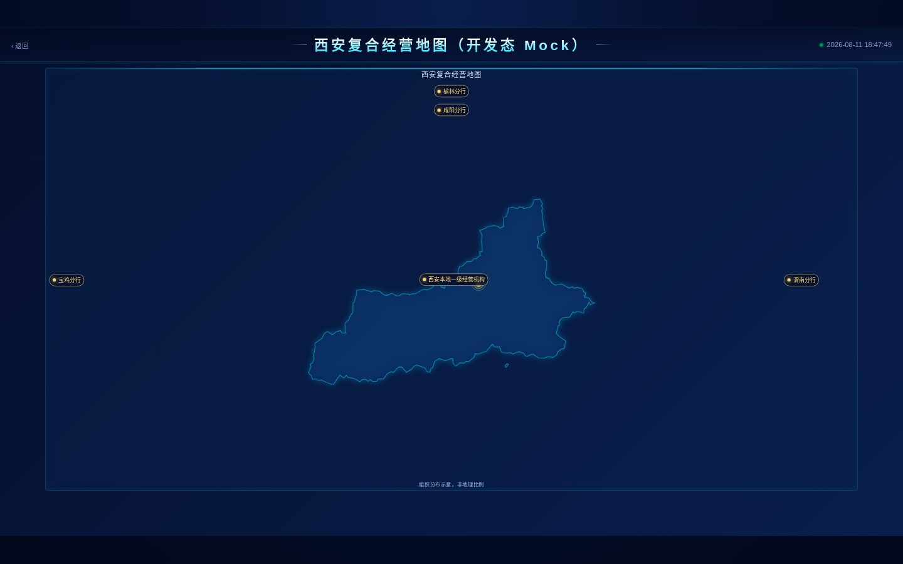
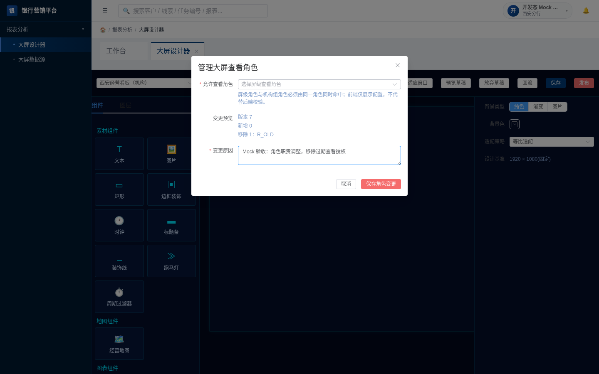
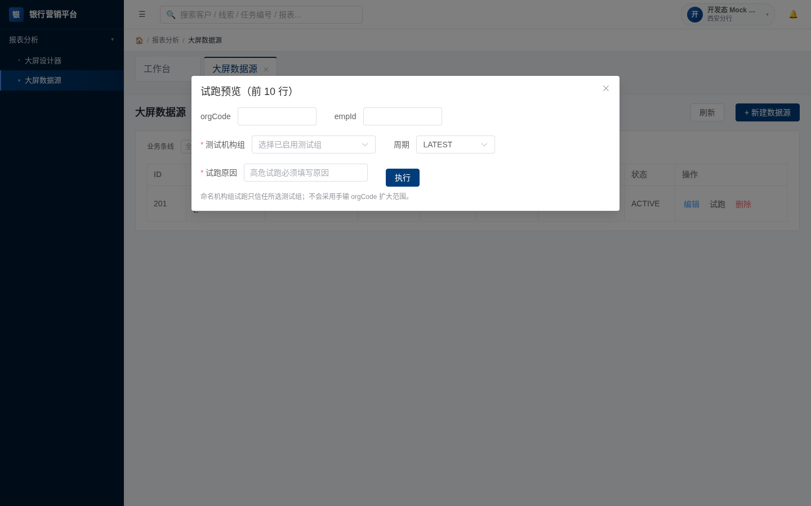

# 屏幕范围前端验收证据（开发态 Mock）

> **边界声明：这不是 `yiti_test` 联调。** 本记录只启动本地 Vite（`127.0.0.1:18190`），并用官方 `@playwright/cli` 的浏览器内 `route` 返回固定 ResponseWrapper mock。没有启动 Spring Boot、没有访问 `18081`、没有连接数据库，也没有执行 DDL/DML。后端鉴权、审计持久化、真实数据范围与真实接口性能仍需在获准后的 `yiti_test` 联调中验证。

## 工具、启动与 Mock

```bash
cd /home/djdev/leid/yiti/xanzc_frontend
VITE_USE_MOCK=false npm run dev -- --host 127.0.0.1 --port 18190

XDG_CACHE_HOME=/tmp/yiti-playwright-cli-cache \
PLAYWRIGHT_BROWSERS_PATH=/home/djdev/.cache/ms-playwright \
npx playwright-cli -s=screen-evidence-final goto \
  'http://127.0.0.1:18190/#/screen/SCR_XIAN_MOCK'
```

浏览器会话使用官方 `@playwright/cli`，并对下列端点注册浏览器内 mock：认证/菜单/权限/通知、`GET /api/screen/view/**`、屏列表及画布、屏角色 `GET /access-roles`、角色/机构组/机构画像、数据源及其 KPI 候选。所有 mock 均为 `{"code":"0","message":"success","traceId":"mock-*","data":...}`；没有用前端静态 mock 隐藏接口错误。

每个页面重载前均执行：

```bash
npx playwright-cli -s=screen-evidence-final console --clear
npx playwright-cli -s=screen-evidence-final requests --clear
npx playwright-cli -s=screen-evidence-final reload
npx playwright-cli -s=screen-evidence-final console warning
npx playwright-cli -s=screen-evidence-final requests
```

复测的 `console warning` 输出为 `Errors: 0, Warnings: 0`；列出的动态 API 均为 `200 OK`。这不是“静默忽略”失败：未匹配路由会显示在 CLI 网络记录中，且不作为成功证据。

## 1. schemaVersion 2 西安复合地图



执行命令（实际按最新 snapshot ref 操作）：

```bash
npx playwright-cli -s=screen-evidence-final resize 1440 900
npx playwright-cli -s=screen-evidence-final goto \
  'http://127.0.0.1:18190/#/screen/SCR_XIAN_MOCK'
npx playwright-cli -s=screen-evidence-final eval '() => /* 读取四个按钮 bbox */'
npx playwright-cli -s=screen-evidence-final press Enter
```

断言结果（CSS 像素；viewport 为 `1440 × 900`）：

| 锚点 | orgCode | 元素 | bounding box `[x,y,right,bottom]` | 完全在 viewport |
| --- | --- | --- | --- | --- |
| LEFT 宝鸡 | `128` | `BUTTON`, `tabindex=0` | `[78.75, 436.875, 134.25, 456.375]` | 是 |
| RIGHT 渭南 | `191` | `BUTTON`, `tabindex=0` | `[1250.25, 436.875, 1305.75, 456.375]` | 是 |
| TOP 咸阳 | `169` | `BUTTON`, `tabindex=0` | `[692.25, 165.75, 747.75, 185.25]` | 是 |
| FAR_TOP 榆林 | `129` | `BUTTON`, `tabindex=0` | `[692.25, 135.75, 747.75, 155.25]` | 是 |

另行以键盘聚焦 FAR_TOP，活动元素为 `BUTTON`，`aria-label=榆林分行，远上方示意导航节点`；按 `Enter` 后 URL 变为 `#/screen/SCR_YULIN?orgCode=129`。地图页控制台为 0 error / 0 warning。固定的 `LEFT/RIGHT/TOP/FAR_TOP` 映射与“组织分布示意，非地理比例”说明均可见。

## 2. 独立高危角色变更



入口是“管理查看角色”，不是新建/编辑范围表单。mock 返回的已有角色为 `R_OLD`、画布版本为 `7`。移除标签并填写原因后，截图和 snapshot 显示：

- 变更预览：`版本 7`、`新增 0`、`移除 1: R_OLD`；
- 原因字段为必填，值为“Mock 验收：角色职责调整，移除过期查看授权”；
- 独立读取请求为 `GET /api/screen/admin/screens/101/access-roles => 200`，画布版本从 `GET /canvas/101 => 200` 获取；
- 为避免把浏览器证据扩展为写入操作，未点击“保存角色变更”。单元测试覆盖的写入体仅为 `{ roleCodes, reason, expectedVersion }`，目标为独立的 `PUT /access-roles`。

该页清空记录并重载后为 0 error / 0 warning；动态读取请求均为 200。普通屏创建/元数据 API 的 payload 剥离 `accessRoles` 与 `blocks` 的断言见前端单元测试结果。

## 3. NAMED_GROUP 数据源试跑 Fail Close



数据源列表 mock 返回新的引用 DTO，界面显示“草稿：`SCR_DEMO`；已发布：`SCR_XIAN_MOCK`”。`scopeMode=NAMED_GROUP` 时，试跑对话框明确呈现两个必填项“测试机构组”“试跑原因”，并显示说明“只信任所选测试组；不会采用手输 orgCode 扩大范围”。

复验中先填写原因、故意不选择测试机构组后点击“执行”：请求记录只含所有已 mock 的 GET（数据源、KPI 候选、机构组等，均为 `200 OK`），**没有** `POST /api/screen/admin/datasources/try-run`。单元测试同时断言请求构建器抛出“命名机构组试跑必须选择测试机构组”，且成功路径只提交显式 `testOrgGroupCode`。

该页清空记录并重载后为 0 error / 0 warning；没有网络失败。

## 覆盖范围与遗留风险

- 本次浏览器证据覆盖前端可见性、键盘语义、严格试跑入口和 mock 网络契约；不替代真实后端权限、审计持久化、CAS、组成员授权和数据库验证。
- schemaVersion 运行时的 v1/v2/未知版本 fail-close、创建/metadata 独立端点、角色 payload 剥离、城市过滤等，由 Vitest API/工具/视图测试覆盖；测试命令和结果在本次提交的最终验证报告中列出。
- 仅验证桌面 `1440 × 900`；移动端、缩放、读屏器与真实 SSO 仍需要后续联调/无障碍验收。

## 代码级验证摘要

```bash
npm test -- --run \
  src/api/__tests__/screen.scope-map.spec.js \
  src/utils/__tests__/screenScope.spec.js \
  src/utils/__tests__/dsConfig.spec.js \
  src/stores/__tests__/screenDesigner.spec.js \
  src/router/__tests__/screenRoutes.spec.js \
  src/views/screen/__tests__/ScreenView.spec.js \
  src/views/screen/admin/__tests__/OrgGroups.spec.js \
  src/views/screen/components/__tests__/MapCenter.scope.spec.js \
  src/views/screen/components/__tests__/ScreenDataContract.spec.js \
  src/views/screen/designer/__tests__/DesignerV2.spec.js
# 10 文件、113 测试通过

npm test
# Test Files：70 passed、1 failed、71 total
# Tests：412 passed、1 failed、413 total
# 因 RedEngineLogout 的既有路由期望不一致，全量测试不算全绿。

npm run build
# 通过
```

全量失败的精确差异为：`RedEngineLogout.spec.js` 期望 `location.replace('/#/redengine/login')`，运行时实际调用 `location.replace('/#/login')`。该文件是用户已有修改，本次没有编辑。
