# Branch Platform（分行业务平台 yiti）系统详细设计文档

> 本文档是 yiti 项目的**总体详细设计**，贯穿系统架构、横切机制、各业务模块设计、典型交易流与数据模型。
> 各模块的更细粒度设计见 `docs/modules/<模块名>/`（每模块 9–11 份编号文档）；共享规范见 `docs/common-dev-guide.md`。
> 图均为 Mermaid，可在 Gitee/GitHub/支持 Mermaid 的 Markdown 阅读器中直接渲染。

---

## 目录

1. [项目概述](#1-项目概述)
2. [技术栈](#2-技术栈)
3. [总体架构](#3-总体架构)
4. [模块交互机制](#4-模块交互机制)
5. [公共基础设施（common）](#5-公共基础设施common)
6. [横切关注点设计](#6-横切关注点设计)
7. [业务模块详细设计](#7-业务模块详细设计)
8. [典型交易流](#8-典型交易流)
9. [数据模型总览](#9-数据模型总览)
10. [部署与环境](#10-部署与环境)
11. [文档索引](#11-文档索引)

---

## 1. 项目概述

**Branch Platform（分行业务平台）** 是面向银行分行的一体化业务运营系统，采用**模块化单体架构**。

- **业务目标**：为银行分行提供客户营销、工作流审批、绩效计算、报表分析的一体化解决方案。
- **核心价值**：模块化设计、权限精细化控制、工作流集成、数据强一致性。
- **业务闭环**：`营销（客户/线索/标签）→ 触达 → 业务落地（资产投放/中场支持）→ 绩效计算 → 报表分析`。
- **交付状态**：9 个业务模块 + 公共基础层 + 外部渠道网关 + 启动模块，全部已交付。

### 1.1 系统分域

| 域 | 模块 | 角色 |
|----|------|------|
| 公共基础层 | common（5 子模块） | 统一响应/鉴权注解/追踪/AOP/DB |
| 支撑域 | auth-permission-center、system-governance-center、workflow-center | 认证授权、系统治理、工作流 |
| 通用域 | portal-content-center | 门户聚合（不持有核心业务状态） |
| 核心域 | customer-marketing-center、business-application-center、performance-engine-center | 客户营销、业务申请、绩效计算 |
| 支撑域（只读） | report-analytics-center | 报表分析（不被业务模块依赖） |
| 接入层 | soap-gateway-center | 外部渠道（SOAP/callpu）网关 |
| 启动入口 | bootstrap | 唯一 Spring Boot 启动入口，组装全部模块 |

---

## 2. 技术栈

**后端**（Spring Boot 3.2.3 + JDK 17）：

| 类别 | 选型 |
|------|------|
| ORM | MyBatis 3.0.3 + MyBatis-Plus 3.5.7（新增功能统一 MyBatis-Plus） |
| 工作流 | Flowable 7.0.1（嵌入式，workflow-center 独占） |
| 数据库 | MySQL 8.0 + Druid 连接池 |
| 缓存 / Session | Redis 6.x（Spring Session） |
| 调度 | Quartz 集群（JDBC JobStore + QRTZ_LOCKS 行锁） |
| 对象存储 | 华为云 OBS（统一文件存储；历史 MinIO 已迁移） |
| API 文档 | Knife4j 4.4.0 |
| 导出 | EasyExcel 3.3.4 |
| 接入网关 | Netty（SOAP 服务端，独立端口 30522） |

**前端**：Vue 3 + Vite + Element Plus（路由 `createWebHashHistory`，菜单后端 `my-menus` 驱动）。

**工具链**：Maven 多模块、Git。

---

## 3. 总体架构

### 3.1 分层与分域架构图

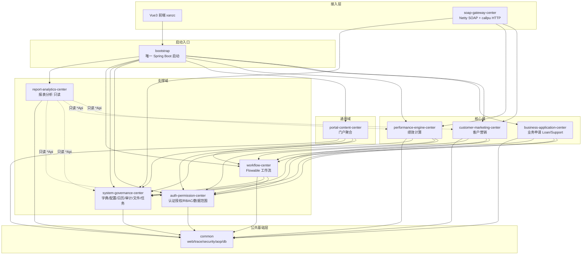

### 3.2 模块依赖规则（红线）

1. 模块间**只通过 `*Api`/`*QueryApi` 接口**交互，禁止直接依赖对方 `mapper`/`entity`/`serviceImpl`。
2. 所有接口必须注册到 `PT_RESOURCE` 表并使用 `@BizAuth` 注解。
3. `workflow-center` 是**唯一**直接调用 Flowable API 的模块。
4. `auth-permission-center` 可被所有模块依赖，但不依赖任何业务模块。
5. `report-analytics-center` **只读**，**不允许**被业务模块依赖（业务模块要报表数据直接调上游 `*Api`）。
6. `portal-content-center` 是通用域，不依赖核心域（指标/工作流通过 Adapter + bootstrap 桥接，遵循 DIP）。

### 3.3 模块依赖图（业务模块层）

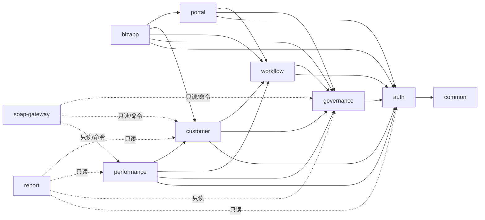

### 3.4 功能模块图

```mermaid
graph TD
    ROOT[分行业务平台 yiti]
    ROOT --> A[认证授权]
    ROOT --> B[系统治理]
    ROOT --> C[工作流]
    ROOT --> D[门户内容]
    ROOT --> E[客户营销]
    ROOT --> F[业务申请]
    ROOT --> G[绩效计算]
    ROOT --> H[报表分析]
    ROOT --> I[外部渠道网关]

    A --> A1[用户/角色/资源 RBAC]
    A --> A2[BizType 数据范围]
    A --> A3[组织架构 EXT_ORG]
    B --> B1[字典/配置/日历]
    B --> B2[审计/通知/文件]
    B --> B3[Quartz 定时任务]
    C --> C1[流程启动/任务审批]
    C --> C2[候选人解析/SLA]
    D --> D1[工作台聚合]
    D --> D2[导航/通讯录/产品库/文档]
    E --> E1[标签/线索/审批]
    E --> E2[客户主档/客户池/认领]
    E --> E3[触达任务/触达报表]
    F --> F1[资产投放 Loan]
    F --> F2[中场支持 Support A/B]
    G --> G1[指标库/KPI方案/目标]
    G --> G2[分配关系/版本控制]
    G --> G3[指标级 Quartz 调度/Groovy]
    G --> G4[数据导入/审批/内部评价]
    H --> H1[动态查询/仪表盘/汇总]
    H --> H2[SQL探查/异步导出]
    H --> H3[AMAS 历史审批查询]
    I --> I1[Netty SOAP 服务]
    I --> I2[callpu 手机端网关]
```

---

## 4. 模块交互机制

yiti 是**模块化单体**：所有模块编译进同一个 `bootstrap` jar、运行在**同一个 JVM** 的**同一个 Spring 容器**内。因此模块间交互**不是 REST/RPC，而是进程内的 Spring Bean 方法调用**——既保留模块边界，又无跨进程网络与序列化开销。共有 4 类交互方式。

### 4.1 同步调用：`*Api`/`*QueryApi` 接口 + Spring 构造注入（主力）

模块间**唯一允许的同步交互方式**。

- 每个模块在 `api/` 包暴露接口（`*Api`/`*QueryApi`）+ DTO；实现类（`*Facade`/`*ServiceImpl`）放 `facade/`，注册为 `@Service`/`@Component`。
- 调用方 Maven 依赖对方模块后，直接 `private final XxxApi xxxApi;`（`@RequiredArgsConstructor` 构造注入）。
- `bootstrap` 是 `@SpringBootApplication`，基础包 `com.bank.branch.platform` 覆盖所有模块 → 组件扫描把各模块 Facade Bean 注册进**同一容器**，注入即生效。
- 运行时是**普通 Java 方法调用**：同 JVM、事务上下文可传播、零网络、零序列化。

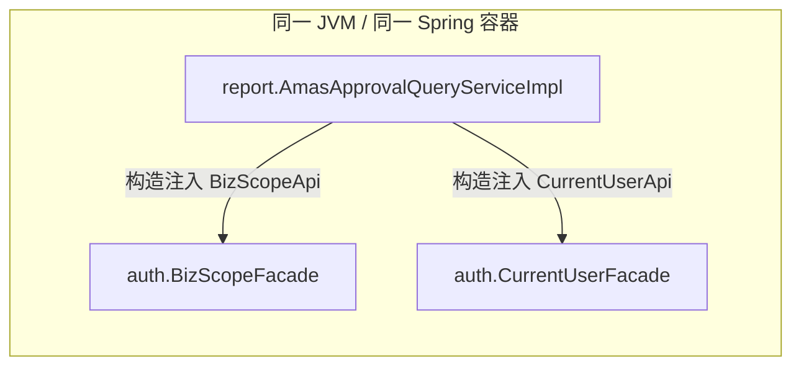

**红线**：只能依赖对方 `api` 包（接口 + DTO），**禁止**直连对方 `mapper`/`entity`/`serviceImpl`；跨模块查询走 `*QueryApi`，不直接 join 别人的表。

**实例**：report 注入 auth 的 `CurrentUserApi`/`BizScopeApi`；customer/bizapp 注入 workflow 的 `WorkflowApi`、governance 的 `DictApi`/`FileApi`/`NotifyApi`；soap-gateway 注入 performance 的 `PerfApprovalQueryApi`。

### 4.2 异步解耦：Spring 领域事件（同 JVM ApplicationEvent）

跨模块的"事后动作"用 Spring 事件松耦合，发布方不直接依赖消费方。

- 发布：`ApplicationEventPublisher.publishEvent(event)`。
- 消费：`@TransactionalEventListener(phase = AFTER_COMMIT)`（主事务提交后才触发，防脏读）。

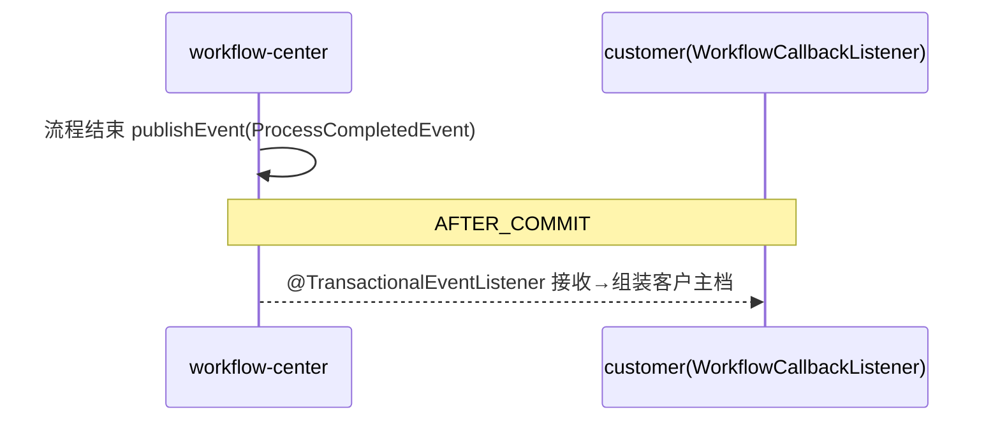

典型事件：workflow `ProcessCompletedEvent` → customer/bizapp 更新业务状态；performance `MetricCalcCompletedEvent` → `KpiCascadeListener` 重算；auth `PermissionCacheInvalidatedEvent`（**当前无消费者**，预留跨节点缓存同步扩展点）。

### 4.3 依赖倒置（DIP）：portal 防腐层 Adapter + bootstrap 桥接

为保持「通用域 portal 不依赖核心域」，portal 不直接依赖 performance/workflow：

- portal 在自身包内**定义抽象接口** `portal.adapter.MetricApi` / `WorkflowQueryApi`；
- `bootstrap` 提供桥接实现 `PerformanceMetricApiBridge implements portal.adapter.MetricApi`，内部注入 `performance.api.MetricApi` 转调；
- portal 的 `MetricAdapter` 按 portal 自己的抽象类型注入到桥接实现。

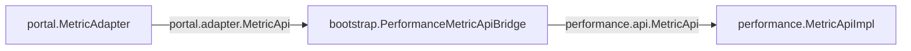

portal 编译期不依赖 performance，依赖方向被「倒置」到 bootstrap 组装层。

### 4.4 共享基础设施层面的间接交互

| 维度 | 机制 |
|------|------|
| 共享数据库 | 同一 MySQL 库，但跨模块数据只通过 `*QueryApi` 读，不互相 join 表 |
| 共享 Redis | Session + 各模块缓存（前缀隔离 `auth:`/`customer:`/`portal:`） |
| 共享上下文 | `CurrentUserProvider` / `DataScopeContext`（ThreadLocal），同一请求线程内各模块共读 |
| 审计 SPI | 业务模块标 `@AuditLog` → common-aop 发 `AuditLogEvent` → governance `GovAuditLogHandler` 落库 |

### 4.5 边界情况

- **外部进程入口**：仅 `soap-gateway-center` 是真正跨进程接入（Netty SOAP 30522 / callpu HTTP），它把外部报文翻译成内部 `*Api` 调用——对内仍是 §4.1。
- **report 只读**：直接调上游 `*Api`，自身不暴露 `*Api`、不被任何业务模块依赖。

### 4.6 交互方式总览

| 方式 | 场景 | 实现 |
|------|------|------|
| `*Api` 接口 + 构造注入 | 同步查询/命令（主力） | 同 JVM Spring Bean 方法调用 |
| Spring 领域事件 | 异步解耦的事后动作 | `@TransactionalEventListener(AFTER_COMMIT)` |
| Adapter + bootstrap 桥接 | 通用域不依赖核心域 | DIP，bootstrap 组装 |
| 共享 DB/Redis/ThreadLocal/SPI | 基础设施层 | 间接协作 |

> **本质**：模块化单体 = 编译期靠 `api` 接口解耦 + 运行期靠 Spring 容器在同一 JVM 内注入装配。

---

## 5. 公共基础设施（common）

`common` 采用 Maven 多模块，含 5 个子模块，通过 Spring Boot 3 `AutoConfiguration.imports` 实现零配置接入。基础包名 `com.bank.branch.platform.common`。

### 4.1 子模块依赖链

```mermaid
graph TD
    WEB[common-web<br/>统一响应/异常/分页/校验]
    TRACE[common-trace<br/>traceId + MDC]
    SEC[common-security<br/>数据范围/@BizAuth/脱敏]
    AOP[common-aop<br/>API日志/计时/审计切面]
    DB[common-db<br/>分页拦截/审计字段填充/慢SQL]
    SEC --> WEB
    TRACE --> WEB
    AOP --> SEC & TRACE
    DB --> SEC
```

### 4.2 各子模块能力

| 子模块 | 关键类 | 能力 |
|--------|--------|------|
| **common-web** | `ResponseWrapper<T>`、`GlobalExceptionHandler`、`PageRequest`/`PageResult`、`BizException`/`AuthException`/`PermissionDeniedException` | 统一响应信封（code/message/traceId/data/page/timestamp）、全局异常映射（401/403/400/405/415/500）、分页模型 |
| **common-trace** | `TraceContext`、`MdcUtils`、`TraceIdFilter`、`TraceIdInterceptor` | 读取/生成 16 位 traceId、注入 MDC、写回 `X-Trace-Id` 响应头 |
| **common-security** | `@BizAuth`、`CurrentUserContext`、`DataScopeContext`、`BizType`/`BizAction`/`DataScopeType` 枚举、`SensitiveDataMasker`、`SignatureUtils` | 方法级鉴权注解、用户上下文、数据范围上下文（ThreadLocal）、脱敏、HmacSHA256 验签；`DataScopeCleanupFilter` 请求结束清理 ThreadLocal |
| **common-aop** | `ApiLogAspect`、`MethodTimingAspect`、`AuditLogAspect`、`@AuditLog`、`AuditLogHandler`(SPI) | 全 `@RestController` 入参/出参/耗时日志、`@Service` 双阈值计时（WARN 500ms/ERROR 5s）、`@AuditLog` → `AuditLogEvent`（由 governance 实现 SPI 落库） |
| **common-db** | `PageInterceptor`、`AuditFieldFiller`、`SlowSqlInterceptor`、`DruidConfig` | 分页拦截 + sortField 防注入（正则 `^[a-zA-Z0-9_]+$`）、审计字段自动填充、慢 SQL 检测（默认 5s） |

### 4.3 枚举常量

- `DataScopeType`（7 类）：`SELF_CREATED`/`SELF`/`SELF_ASSIGNED`/`ORG`/`ORG_SUBTREE`/`ALL`/`WORKFLOW_PARTICIPANT`。
- `BizType`：NAV/CLAIM/LOAN/SUPPORT/KPI_CALC/REPORT/PERF_CONFIG/SYS_CONFIG/CUSTOMER/LEAD/TOUCH 等（含中文 description，作为前端展示单一真相源）。
- `BizAction`：READ/WRITE/DELETE/LIST/EXPORT/IMPORT/CONFIG/EXECUTE/PERMISSION_CHANGE/EXECUTE_SQL 等。

---

## 6. 横切关注点设计

### 6.1 五层鉴权链路

请求进入 `/api/**` 的处理顺序：

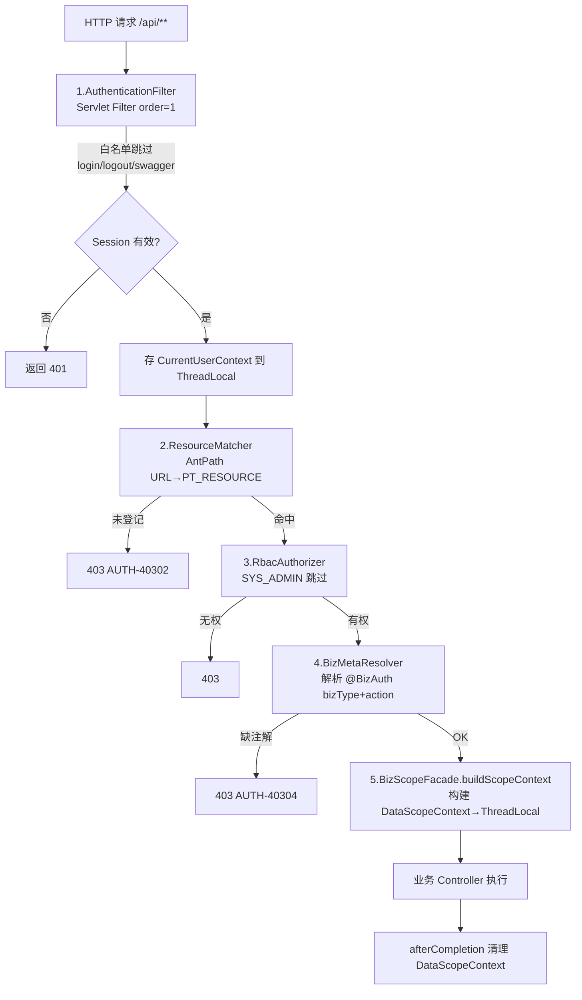

### 6.2 RBAC 数据模型

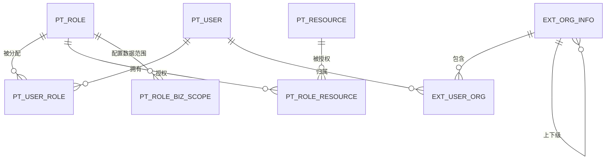

- `PT_RESOURCE` 同时承载菜单（`ISMENU=1`）与接口资源（`ISMENU=0`）；菜单层级用 `PARENT_RESOURCE_ID`，叶子 `MENU_ENDFLAG=1`。
- 前端侧边栏走 `GET /api/auth/my-menus`：按用户**当前生效角色**取 `PT_ROLE_RESOURCE → PT_RESOURCE(ISMENU=1)` 并剪枝祖先链。

### 6.3 BizType 数据范围（DATA_SCOPE）解析

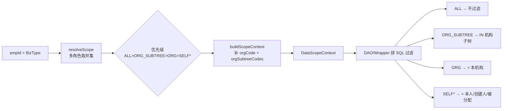

- 多角色按优先级取**最大**范围；只取「本次请求生效角色」。
- **Fail-Close**：角色未配置该 BizType 默认 `SELF`（最小权限）；`ORG_SUBTREE` 子树空 / `ORG` 无机构 → `WHERE 1=0`。

### 6.4 其它横切机制

| 机制 | 设计 |
|------|------|
| **缓存** | Cache-Aside + Redis，5–10 分钟 TTL，业务模块前缀（`auth:`/`customer:`/`portal:`）+ 10% 随机抖动防雪崩；权限变更发 `PermissionCacheInvalidatedEvent`（USER_ROLE/ROLE_RESOURCE/BIZ_SCOPE） |
| **定时调度** | 统一 Quartz 集群（`isClustered=true` + JDBC JobStore），防重由 `QRTZ_LOCKS` 行锁接管；业务模块提供裸 `run()` + `QuartzJobBean` 包装；`JobExecutionLogger` 全局 JobListener 统一写 `sys_job_run_log`；启动期 `syncJobsOnStartup` 按 `sys_job_conf` 同步 |
| **文件存储** | 统一 governance `FileApi` → `ObsStorageClient` → 华为云 OBS；`file_object.id` 为业务引用；OBS 失败抛 `GOV-50001` 无本地兜底。**例外**：perf 的指标/KPI/目标导入存本地 `file-storage/perf-import/` 不上传 OBS |
| **审计** | `@AuditLog` → `AuditLogEvent` → governance `GovAuditLogHandler`（SPI，REQUIRES_NEW 写 `audit_log`，异常隔离不阻塞主事务）；高危操作 `reasonRequired=true` |
| **领域事件** | Spring `ApplicationEvent` + `@TransactionalEventListener(AFTER_COMMIT)`，跨模块松耦合 |
| **统一响应/分页** | `ResponseWrapper<T>`；分页 `PageRequest`/`PageResult`，pageSize 最大 100，>5000 行必须异步导出 |
| **错误码** | `{PREFIX}-{HTTP_STATUS}{SEQ}`，前缀注册表 SYS/AUTH/GOV/PORTAL/CUST/WF/BIZ/PERF/RPT |

---

## 7. 业务模块详细设计

> 以下每模块给出：职责、依赖、核心表、对外 API、主要 REST 端点、关键设计。更细见 `docs/modules/<模块>/`。

### 7.1 认证授权中心（auth-permission-center）

- **职责**：用户认证、RBAC 权限、BizType 数据范围、组织架构。基础包 `com.bank.branch.platform.auth`。平台安全核心，被所有模块依赖，不依赖任何业务模块。
- **核心表（8 张）**：`PT_USER`/`PT_ROLE`/`PT_USER_ROLE`/`PT_RESOURCE`/`PT_ROLE_RESOURCE`/`PT_ROLE_BIZ_SCOPE`（RBAC 核心）+ `EXT_ORG_INFO`/`EXT_USER_ORG`（外部同步只读）。
- **对外 API（5）**：`AuthApi`（登录/会话）、`CurrentUserApi`（读 ThreadLocal 零 DB）、`ResourceApi`（资源匹配/权限/URL 列表）、`BizScopeApi`（数据范围解析/上下文/写权限校验）、`OrgApi`（机构子树查询）。
- **主要端点**：`/api/auth/`（登录/登出/当前用户/my-menus）、`/api/admin/roles/`、`/api/admin/users/{id}/roles/`、`/api/admin/resources/`（资源/菜单 CRUD + 角色绑定 + **资源维度分配角色** `GET/PUT /resources/{id}/roles`）、`/api/admin/biz-scopes/`、`/api/orgs/`。
- **关键设计**：5 层鉴权链路；BCrypt 密码 + 5 次错误锁定；Cache-Aside（user-roles/role-resource/biz-scope/resource:all/org-subtree）；菜单分配联动接口绑定；BizScope upsert + 多角色并集。

### 7.2 系统治理中心（system-governance-center）

- **职责**：字典、配置、工作日历、审计、通知、文件、定时任务等通用治理。基础包 `com.bank.branch.platform.governance`。被所有模块依赖（workflow 依赖其 Calendar/Notify）。
- **核心表（9 张）**：`sys_dict`、`sys_config_kv`、`sys_calendar_day`、`audit_log`（不可变）、`user_notification`、`file_object`、`biz_file_rel`、`sys_job_conf`、`sys_job_run_log`；另含 Quartz 11 张 `QRTZ_*`。
- **对外 API（7）**：`DictApi`（字典，TTL 10m）、`ConfigApi`（KV 配置）、`CalendarApi`（工作日，TTL 24h）、`AuditApi`（REQUIRES_NEW 写审计）、`NotifyApi`（通知）、`FileApi`（OBS 上传/下载/绑定）、`JobApi`（registerJob/unregisterJob/getJobConf）。
- **主要端点**：`/api/sys/dicts`、`/api/admin/sys/configs|calendar|jobs`、`/api/admin/audit-logs`、`/api/notifications`、`/api/files/upload|{id}/download-url`、`/api/admin/sql-probe`。
- **关键设计**：Quartz 集群唯一集成点（`JobExecutionLogger` 全局监听写日志）；`GovAuditLogHandler` 实现 common-aop SPI；`ObsStorageClient` 封装 OBS 读写删 + 预签名 URL。

### 7.3 工作流中心（workflow-center）

- **职责**：集成 Flowable 7.0.1，提供流程启动、任务审批、SLA、候选人解析。**唯一**直接调用 Flowable API 的模块。基础包 `com.bank.branch.platform.workflow`。
- **核心表（4 张业务表 + Flowable ACT_\*）**：`biz_process_map`（业务↔流程实例桥，businessKey=`BIZ_TYPE:id`）、`wf_node_candidate_conf`（候选人 ROLE/ORG/USER）、`wf_node_form_conf`（节点表单 JSON）、`wf_timeout_rule`（SLA 红/黄灯阈值）。
- **对外 API**：`WorkflowApi`：`startProcess`、`getProcessByBusinessKey`、`getProcessByBizTypeAndBizId`；支持 bizType：LEAD/LOAN/SUPPORT/TOUCH/TARGET_ADJUST/ALLOC_ADJUST。另有 `WorkflowQueryApi.queryParticipatedBusinessKeys`（数据范围 WORKFLOW_PARTICIPANT）。
- **主要端点**：`/api/workflow/tasks/`（todo/done/详情/claim/approve/reject/transfer）、`/api/workflow/processes/`、`/api/admin/workflow/`（候选人配置/超时规则）。
- **关键设计**：Flowable 极简配置（history=audit、idm 关闭用自有 auth）；`TaskAssignmentListener` 任务创建解析候选组 + 发通知；`ProcessCompletedListener` 更新状态 + 发 `ProcessCompletedEvent`；SLA 走 `CalendarApi` 算工作日。

### 7.4 门户与内容中心（portal-content-center）

- **职责**：工作台聚合、导航、通讯录、产品资料库、文档。通用域，只读聚合不持有核心域状态。基础包 `com.bank.branch.platform.portal`。
- **核心表（5 张）**：`product_info`、`portal_nav`、`doc_info`、`addrbook_employee`（通讯录员工）、`portal_shortcut`。
- **对外 API（5）**：`ProductApi`、`NavApi`、`DocumentApi`、`AddressBookApi`、`PortalApi`；另定义 2 个适配器接口 `MetricApi`/`WorkflowQueryApi`（由 bootstrap 桥接核心域实现，DIP）。
- **主要端点**：`/api/products`、`/api/admin/nav`+`/api/nav`、`/api/admin/documents`+`/api/documents`、`/api/employees`、`/api/portal/shortcuts`、`/api/portal/workspace`（工作台聚合：指标卡 + 待办 + 快捷 + 通知）。
- **关键设计**：产品导出 EasyExcel 同步（≤5000 行）；`AddressBookApi` 是员工存在性权威源之一；`PerformanceMetricApiBridge`（bootstrap）桥接指标，保持「通用域不依赖核心域」。

### 7.5 客户营销中心（customer-marketing-center）

- **职责**：客户全生命周期——标签、线索（含审批流）、客户主档、客户池与认领、触达任务、触达报表。基础包 `com.bank.branch.platform.customer`。核心业务模块。
- **核心表（8 张）**：`cust_tag`、`cust_tag_rel`、`cust_lead`、`lead_import_batch`、`cust_master`、`cust_claim`（cust_id+org_id UK 防并发）、`touch_task`、`touch_log`（task_id+client_uuid UK 幂等）。
- **对外 API（5）**：`TagApi`、`LeadApi`、`CustomerQueryApi`、`ClaimApi`、`TouchTaskQueryApi`（共 36 端点）。
- **主要端点**：`/api/tags`、`/api/leads`(+import/versions)、`/api/customers`(+pool/history/export/tags)、`/api/claims`、`/api/touch-tasks`、`/api/touch-reports`、`/api/admin/touch-tasks`。
- **关键设计**：线索提交 `SELECT FOR UPDATE` + `WorkflowApi`；审批回调经 `ProcessCompletedEvent` → `WorkflowCallbackListener`（V1.11 改同步直调）；认领 `DuplicateKeyException` 防并发（CUST-40904）；触达日志 clientUuid 幂等；标签覆盖式导入（先删后插）；触达状态机 PENDING→IN_PROGRESS→SUCCESS/CANCELLED；`LeadCallbackCompensateQuartzJob` 回调补偿（cron `0 */5 * * * ?`）。

### 7.6 业务申请中心（business-application-center）

- **职责**：资产投放申请（Loan）+ 中场支持申请（Support）。营销闭环的落地环节，绩效/报表最重要事实源。基础包 `com.bank.branch.platform.bizapp`。依赖 customer + portal。
- **核心表（2 张）**：`loan_apply`（businessKey=`LOAN:{id}`）、`support_request`（submitGroupId 拆单、businessKey=`SUPPORT:{id}`）。
- **对外 API（5）**：`LoanApi`/`LoanQueryApi`、`SupportApi`/`SupportQueryApi`、`BizApplyQueryApi`（共 21 端点）。
- **主要端点**：`/api/loans`（9）、`/api/support-requests`（发起侧 8）、`/api/support-dept/requests`（承接侧 4）。
- **关键设计**：统一 `BizStateMachine`（Loan：DRAFT→IN_APPROVAL→COMPLETED/REJECTED/CANCELLED；Support 多 IN_PROGRESS）；场景路由 A（产品直达 `support_simple_v1`）/B（部门承接 `support_complex_v1`）；多产品拆单共享 submitGroupId；双视图权限（发起侧 owner_org+created_by / 承接侧 support_dept+assigned_emp）；`@TransactionalEventListener(AFTER_COMMIT)` + 条件 UPDATE 幂等。

### 7.7 绩效计算中心（performance-engine-center）

- **职责**：指标库、KPI 方案、目标管理、客户分配关系、数据版本控制、调整审批、异步导出、数据范围注入、内部评价（eval 子域）。基础包 `com.bank.branch.platform.performance`。代码量最大（500+ Java）。
- **核心表**：
  - 配置表：`sys_control`、`perf_metric_def`（含 cron_expr/subject_sql）、`perf_metric_ref`、`perf_kpi_scheme`、`perf_kpi_item`、`perf_target_plan`。
  - 业务数据：`perf_target_value`、`cust_alloc_relation`。
  - 宽表：`emp_index_result`/`org_index_result`/`cust_index_result`/`kpi_result`。
  - 日志：`perf_run_task`。
  - eval 子域：`EVAL_TAG`、`EVAL_USER_TAG`、`EVAL_RULE`/`EVAL_RULE_GROUP`、`EVAL_TASK/TARGET/SCORE`、`EVAL_ASSIGN_BATCH`/`EVAL_ASSIGN_ITEM`、`EVAL_USER_SETTING`。
- **对外 API（7）**：`MetricApi`、`MetricQueryApi`、`KpiApi`、`TargetApi`、`PerfCalcApi`、`DataTaskApi`、`AllocApi`。
- **主要端点**：`/api/perf/metrics`、`/api/perf/kpi-schemes`、`/api/perf/target-plans|target-values`、`/api/perf/alloc-relations`、`/api/perf/sys-control`、`/api/perf/run-tasks`、`/api/perf/import`、`/api/perf/recalc` 及 eval `/api/eval/*`。
- **关键设计**：指标级 Quartz 调度（每条 ACTIVE+AUTO 指标 1:1 注册 Job，`MetricExecuteQuartzJob` 派发）；Groovy 表达式执行 + `SubjectFetcher`；KPI 事件驱动重算（`MetricCalcCompletedEvent` → `KpiCascadeListener` + Redis 防重）；版本控制 `sys_control`；分配/目标调整 BPMN 审批 + 4 类领域事件；数据导入策略（TARGET/BASE_DATA/ALLOC/METRIC_DEF/METRIC_RESULT/KPI_SCORE/KPI_SCHEME/TARGET_PLAN，整批 all-or-none vs 行级最大努力）；`PerfScopeHelper` 7 类数据范围注入；导入源文件 OBS 归档（指标/KPI/目标导入改本地）。

### 7.8 报表分析中心（report-analytics-center）

- **职责**：动态查询、仪表盘、汇总报表、SQL 探查、异步导出、AMAS 历史审批查询。**只读**支撑域，不暴露 `*Api`、不被业务模块依赖。基础包 `com.bank.branch.platform.report`。
- **核心表（自有 4 张）**：`rpt_saved_query`、`rpt_snapshot_task`、`sql_probe_history`、`rpt_export_task`；另只读消费外来 AMAS 表（`AMAS_PERF_ADJUST_APPROVAL`、`AMAS_PERFORMANCE_ALLOCATION`、`AMAS_APPR_RECORD`、`AMAS_PRICE_APPROVAL`）。
- **跨模块**：只读消费 auth(CurrentUser/BizScope/Org)、governance(Dict/Audit/File)、performance(Metric/Kpi)、customer(CustomerQuery/TouchTaskQuery) 的 `*Api`。
- **主要端点（24+）**：`/api/reports/query-dimensions`、`/dynamic-query`、`/saved-queries`、`/dashboard/*`、`/touch-task-summary`、`/perf-summary`、`/customer-pool-summary`、`/sql-probe/*`、`/export-tasks/*`；以及 AMAS 历史查询 `/amas-approvals`（业绩调整查询）、`/amas-price-approvals`（定价审批查询）。
- **关键设计**：只读红线 + ArchTest 守护（api/ 无 `*Api.java`、Controller 不出现 Entity、所有方法 `@BizAuth(REPORT)`）；SQL 探查独立只读数据源 + JSqlParser AST 校验（仅 SELECT/白名单/子查询深度≤3）；异步导出 4 策略走 OBS；DATA_SCOPE 7 类在仪表盘/汇总/AMAS 查询生效（AMAS 表无机构列时 fail-close 到本人）。

### 7.9 外部渠道网关（soap-gateway-center）

- **职责**：把手机端/ICPS/ESB 外部报文转换为对内部 `*Api` 的调用。基础包 `com.bank.branch.platform.soap`。含两条接入链路。
- **链路 1（Netty SOAP）**：独立端口 30522，`SoapDispatchHandler` 按 uri(=服务号) 路由到 `SoapEndpoint`；`/ishealth` 健康检查，`/S080021264` → `AxlryPrsRvrSysSvcEndpoint`（命名空间剥离 JAXB 绑定 → callpu JSON → 业务）。
- **链路 2（callpu HTTP）**：`POST /api/callpu`，按 `RuleName` 分发（PERF_LIST/PERF_MY_LIST/PERF_SAVE/CASH_GETCUST_INFO/PERF_RECALL/PERF_APPR/PERF_ORIG_ALLOC/PERF_INFO/SYS_DICT_ITEMS）。
- **跨模块**：performance(`PerfApprovalQueryApi`/`PerfApprovalCmdApi`)、customer(`CustomerQueryApi`)、governance(`DictApi`)。
- **关键设计**：两链路共用 `CallPuDispatchService`；响应信封始终 HTTP 200（`ReturnCd` 判定成功，业务异常降级为失败信封）；`CallPuContentTypeNormalizationFilter` 解决 urlencoded → SYS_415 兼容（伪装 Content-Type 为 json，不读 body）；外部入口不挂 `@BizAuth`（身份由上游 ESB 完成）。

---

## 8. 典型交易流

### 8.1 线索审批闭环（customer + workflow + governance）

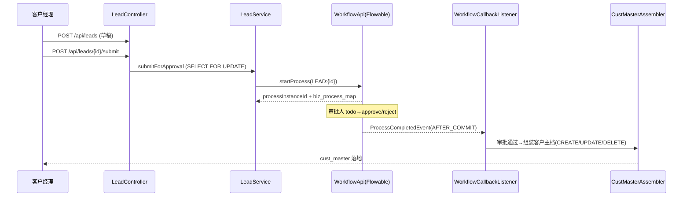

### 8.2 业绩调整审批 + 报表查询（performance + workflow + report/AMAS）

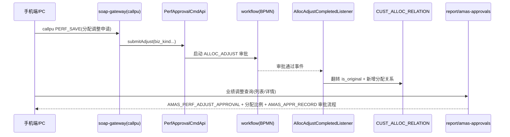

### 8.3 触达任务闭环（customer）

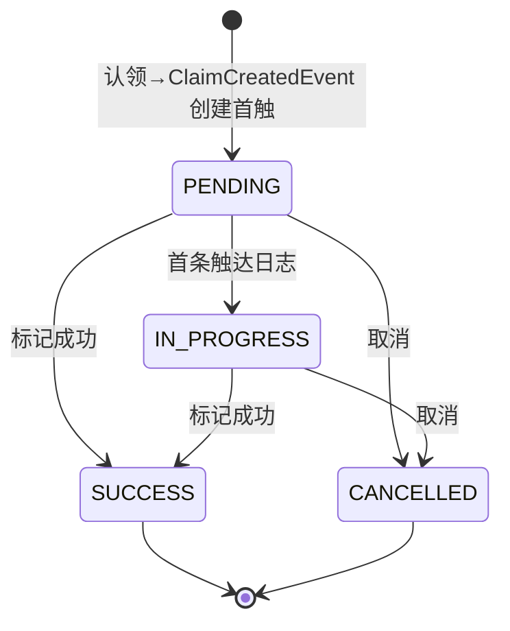

### 8.4 callpu 手机端网关分发（soap-gateway）

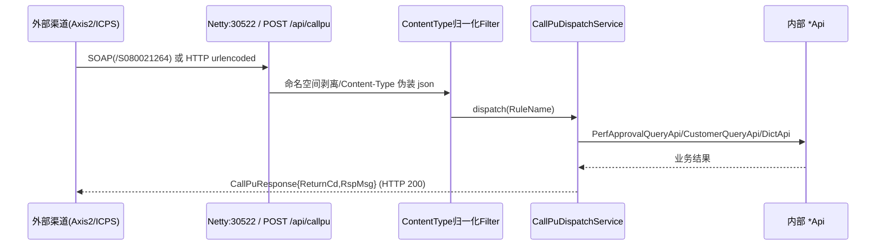

### 8.5 业务申请状态机（bizapp）

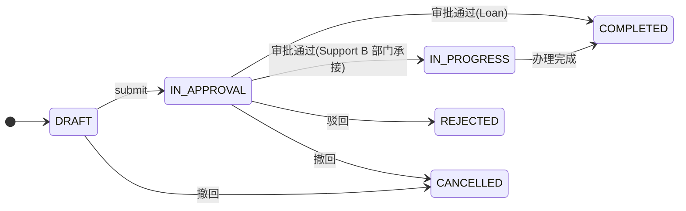

---

## 9. 数据模型总览

### 9.1 按模块分组的核心表

```mermaid
graph TD
    subgraph auth
        a1[PT_USER/PT_ROLE/PT_USER_ROLE]
        a2[PT_RESOURCE/PT_ROLE_RESOURCE/PT_ROLE_BIZ_SCOPE]
        a3[EXT_ORG_INFO/EXT_USER_ORG]
    end
    subgraph governance
        g1[sys_dict/sys_config_kv/sys_calendar_day]
        g2[audit_log/user_notification]
        g3[file_object/biz_file_rel]
        g4[sys_job_conf/sys_job_run_log/QRTZ_*]
    end
    subgraph workflow
        w1[biz_process_map]
        w2[wf_node_candidate_conf/wf_node_form_conf/wf_timeout_rule]
        w3[ACT_* Flowable]
    end
    subgraph customer
        c1[cust_tag/cust_tag_rel]
        c2[cust_lead/lead_import_batch]
        c3[cust_master/cust_claim]
        c4[touch_task/touch_log]
    end
    subgraph bizapp
        b1[loan_apply/support_request]
    end
    subgraph performance
        p1[sys_control/perf_metric_def/perf_kpi_scheme/perf_target_plan]
        p2[perf_target_value/cust_alloc_relation]
        p3[emp/org/cust_index_result/kpi_result]
        p4[EVAL_* 内部评价]
    end
    subgraph portal
        po1[product_info/portal_nav/doc_info]
        po2[addrbook_employee/portal_shortcut]
    end
    subgraph report
        r1[rpt_saved_query/rpt_snapshot_task]
        r2[sql_probe_history/rpt_export_task]
        r3[AMAS_* 外来只读]
    end
```

### 9.2 DDL 权威源

| 文件 | 模块 |
|------|------|
| `docs/schema/ddl-auth.sql` | 认证授权 + RBAC + 数据范围 |
| `docs/schema/ddl-governance.sql` / `ddl-quartz.sql` | 治理 + Quartz |
| `docs/schema/ddl-workflow.sql` | Flowable |
| `docs/schema/ddl-customer.sql` | 客户营销 |
| `docs/schema/ddl-bizapp.sql` | 业务申请 |
| `docs/schema/ddl-portal.sql` | 门户内容 |
| `docs/schema/ddl-performance.sql` / `ddl-eval.sql` | 绩效 + 内部评价 |
| `docs/schema/ddl-report.sql` | 报表分析 |
| `docs/schema/ddl-yiti-full.sql` | 全库基线 |

> 增量变更走 `docs/superpowers/sql/YYYY-MM-DD-*.sql`（禁止 Flyway；执行前备份到 `sql/backup/`）。

---

## 10. 部署与环境

| 项 | 配置 |
|----|------|
| 启动入口 | `bootstrap` 模块，`server.port=18080`，`spring.profiles.active=dev` |
| 数据库 | MySQL 8.0，dev 连 `yiti`（生产 `onepl`） |
| 缓存 | Redis 6.x `localhost:6379` |
| 对象存储 | 华为云 OBS（`obs:` 配置：endPoint/accessKey/bucketName/presignExpireSeconds） |
| SOAP 网关 | Netty 独立端口 30522（`application-soap.yml`） |
| 构建 | `mvn clean install`（跨模块改动必须 install 上游避免 stale jar）；启动 `cd bootstrap && mvn spring-boot:run` 或 `java -jar bootstrap/target/bootstrap-1.0.0-SNAPSHOT.jar` |
| API 文档 | Knife4j `http://localhost:18080/doc.html` |
| 前端 | Vue3+Vite（wangyq/xanzc_frontend），`npm run build`；菜单后端 `my-menus` 驱动 |

### 10.1 开发红线（节选）

- **TDD**：红-绿-重构闭环，禁止事后补测试。
- **Flyway 已废弃**：schema 变更走 SQL 直接执行。
- **MyBatis-Plus**：新增功能 Mapper `extends BaseMapper`，单条 CRUD 用内置，XML 只写自定义 SQL。
- **跨模块只走 `*Api`**；新接口登记 `PT_RESOURCE` + `@BizAuth`；高危操作独立 URL + 单独授权 + 单独审计。

---

## 11. 文档索引

| 主题 | 路径 |
|------|------|
| 共享开发规范（9 章） | `docs/common-dev-guide.md` |
| 各模块详细设计（9–11 份/模块） | `docs/modules/<模块名>/01-功能规格 … 09-依赖契约摘要` |
| 数据库 DDL + 种子 | `docs/schema/` |
| 设计规格 / 实现计划 | `docs/superpowers/specs/`、`docs/superpowers/plans/` |
| 增量/对齐/回归 SQL | `docs/superpowers/sql/`（日期前缀） |
| 会话与决策存档 | `docs/superpowers/sessions/` |
| 运维 Runbook（调度/任务） | `docs/modules/system-governance-center/09-运维Runbook.md` |
| 各模块上下文摘要 | `<模块名>/AGENTS.md`（开发时必读） |

---

> **维护约定**：本文档为总体设计的单一入口，内容随模块 `AGENTS.md` / `docs/modules` 演进而更新；新增模块或重大架构调整时同步修订本文（架构图、模块依赖图、数据模型图、交易流图）。
