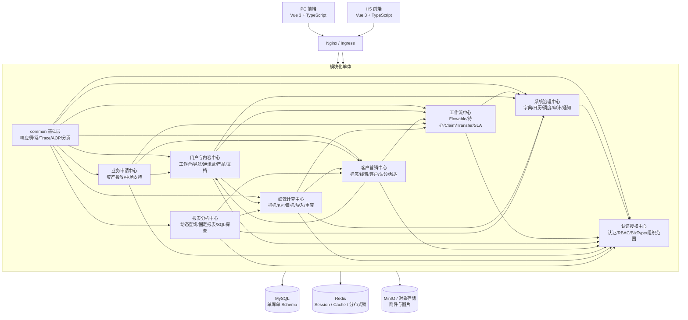
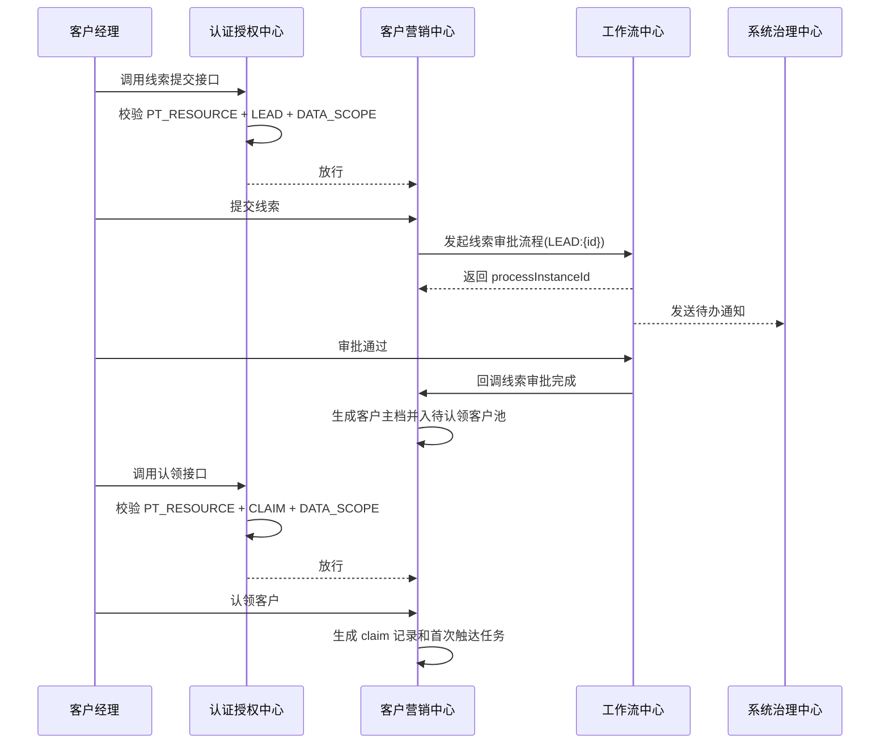
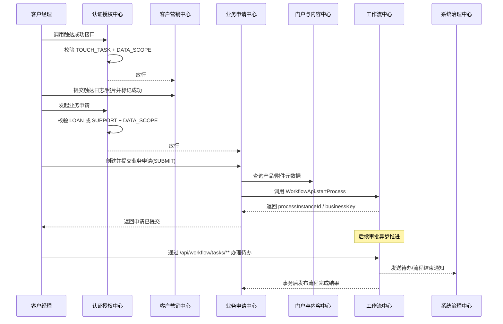
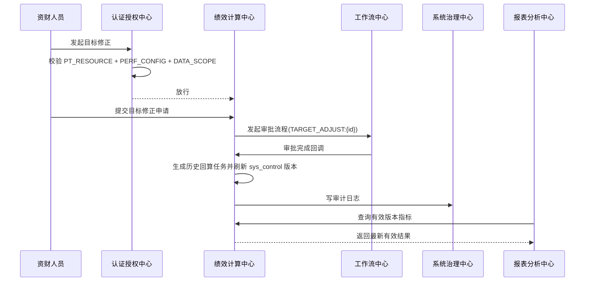

# 基于 `project_ana.md` 的技术方案设计与系统架构拆分

> 结论先行：V1 推荐采用“模块化单体 + 单库单 Schema + 定制 Spring Boot 框架适配 + Flowable 集中集成 + Redis 无状态化 + 对象存储附件管理”的方案。
>

---

## 0. 设计前提与取舍

### 0.1 新增输入与设计影响

本次设计除 `project_ana.md` 外，额外纳入以下输入：

| 输入文件 | 关键信息 | 对架构设计的影响 |
| --- | --- | --- |
| `权限控制表.txt` | 已存在用户、角色、资源、角色资源、用户角色、机构、用户机构表 | 认证授权必须以现有定制框架表结构为基础接入，不能另起一套用户权限体系 |
| `permission_code_skeleton_v1.md` | 建议采用 `Filter + Interceptor + 注解 + DataScope` 的权限落地链路 | 需要把“认证、RBAC、BizType、统一数据范围、审计”抽成独立模块，而不是散落到各业务模块 |
| `permission_resource_catalog_v1.md` | `PT_RESOURCE(RESOURCE_URL + RESOURCE_METHOD)` 为最小鉴权单元，接口需按资源登记 | 接口设计必须兼容菜单/按钮/接口统一鉴权，高危动作必须拆独立 URL |

补充约束：

1. 认证授权必须兼容定制 Spring Boot 框架已有表与资源模型。
2. 用户认证与用户权限必须作为单独模块显式设计。
3. 业务权限不能只停留在菜单层，必须落实到接口资源层。
4. BizType 的统一 `DATA_SCOPE` 必须纳入整体架构，而不是实现阶段再补。

### 0.2 功能点归类与模块归属

| 需求范围 | 主要功能 | 归属模块 |
| --- | --- | --- |
| `2.x`、`4.6.1`、补充权限文档 | 登录态、当前用户、角色资源、数据范围、组织范围、接口鉴权、权限变更 | 认证授权中心 |
| `4.6.3`~`4.6.6` | 字典、工作日历、任务调度、审计、通知、系统运维能力 | 系统治理中心 |
| `4.1.1`~`4.1.5` | 工作台、网址导航、通讯录、产品资料库、文档下载 | 门户与内容中心 |
| `4.2.1`~`4.2.7` | 标签、线索、客户主档、客户池、认领、触达任务、触达管理 | 客户营销中心 |
| `4.6.2`、`3.2.2`、`3.2.3` | Flowable 集成、待办、已办、Claim、Transfer、SLA 红黄绿灯、节点绑定 | 工作流中心 |
| `4.3.1`、`4.3.2` | 资产投放申请、中场支持申请、派单、节点办理 | 业务申请中心 |
| `4.4.1`~`4.4.8`、`3.2.1` | 指标库、KPI、目标、导入、分配关系调整、重算、版本控制 | 绩效计算中心 |
| `4.5.1`~`4.5.3` | 动态指标查询、固定报表、SQL 探查 | 报表分析中心 |
| `4.7.x` | H5 待办、通知、客户查询、触达办理、指标查看 | 前端渠道复用上述后端模块 API，不单独拆后端域模块 |

### 0.3 架构方案

| 描述 | 优点 | 缺点 | 结论 |
| --- | --- | --- | --- |
| 模块化单体，认证授权独立成模块，其他业务模块按域拆分 | 强一致性最好；交付最快；最适合当前单库单 Schema；便于适配定制框架 | 发布粒度较粗 | **推荐** |

### 0.4 关键技术取舍

| 主题 | 备选方案 | 推荐方案 | 原因 |
| --- | --- | --- | --- |
| 认证授权落地 | 仅 RBAC；RBAC + BizType；业务内手写判断 | `PT_RESOURCE + PT_ROLE_RESOURCE + PT_ROLE_BIZ_SCOPE + BizAuth 注解` | 与定制框架最契合，同时满足菜单/按钮/接口统一鉴权 |
| 数据范围落地 | MyBatis 自动注入；Service/DAO 显式校验 | 先用显式校验为主，复杂查询再局部插件化 | 显式优于隐式，便于 Code Review 与排障 |
| 工作流接口设计 | 通用工作流接口；按业务各自一套 | 通用待办接口 + 业务接口分离 | 降低接口重复，同时保留 `business_key + 节点/入口策略 -> BizType` 映射 |
| API 版本策略 | URL 路径版本；Header 版本 | URL 路径版本策略，不使用 Header；当前 V1 默认 `/api`，破坏性升级再切 `/api/v2` | 便于 `PT_RESOURCE` 精确登记与菜单配置 |


### 0.4.1 Flowable 7.x 集成取舍

| 主题 | 备选方案 | 推荐方案 | 原因 |
| --- | --- | --- | --- |
| Flowable 运行时接入 | 嵌入式引擎；外部 REST 服务 | **嵌入式引擎** | “模块化单体 + 单库单 Schema + 本地事务强一致”；流程发起/办理需与业务主单状态、`business_key`、`biz_process_map` 同事务提交 |
| 用户与组织来源 | `PT_* / EXT_*`；Flowable Identity/IDM | **`PT_* / EXT_*`** | 本系统已有权威权限模型，避免双主数据源 |
| 候选组来源 | 系统计算；Identity/IDM 组表 | **系统计算后写入 identity link** | 候选规则依赖角色/岗位/组织边界，语义在本系统 |
| 历史查询入口 | 业务 SQL 直查引擎表；统一领域服务/Query API | **统一领域服务/Query API** | 降低耦合，避免各模块直接绑定引擎表 |

### 0.5 潜在循环依赖风险与规避

| 风险点 | 风险说明 | 规避策略 |
| --- | --- | --- |
| 门户聚合反向依赖业务模块 | 工作台需要聚合待办、通知、指标、快捷入口 | 门户只做只读聚合，不持有业务状态，不允许业务模块反向依赖门户 |
| 工作流直接操作业务表 | `workflow` 如果直接更新 `loan_apply`、`support_request`、`cust_lead`，会形成反向耦合 | 工作流中心只管理流程元数据和任务状态，业务状态回写由业务模块回调完成 |
| 报表成为“公共查询中心” | 业务模块为了偷懒反向依赖报表模块 | 报表分析中心只读，不允许任何业务模块依赖报表模块 |
| 认证授权反向依赖业务模块 | 权限模块如果读取业务表判断权限，会形成全局耦合 | 认证授权中心只依赖 `PT_* / EXT_*` 与统一的资源/BizType 元数据，不读取业务表 |
| 系统治理依赖工作流、工作流又依赖系统治理 | 流程超时规则、日历、通知容易互相嵌套 | 保持“工作流中心依赖系统治理中心，系统治理中心不依赖工作流中心” |

---

## 1. 架构全景图



### 1.1 落地原则

1. V1 只部署一个 Spring Boot 应用，但代码必须按业务模块分包、分边界、分 API。
2. 所有模块默认无状态，登录态、资源缓存、范围缓存与幂等键全部放 Redis。
3. 所有接口资源都要可登记到 `PT_RESOURCE(RESOURCE_URL + RESOURCE_METHOD)`。
4. 所有跨模块调用都必须通过 `*Api / *QueryApi`，严禁直接引用对方 `mapper/entity`。
5. 所有模块必须透传 `traceId`，并在入口与出口统一记录日志。
6. 所有高危动作必须单独 URL、单独授权、单独审计。

---

## 2. 模块定义表

| 模块 | 类型 | 负责什么 | 不负责什么 | 对外暴露能力 | 负责人 |
| --- | --- | --- | --- | --- | --- |
| 认证授权中心 `auth-permission-center` | 支撑域 | 用户认证、当前用户上下文、资源匹配、角色资源授权、BizType 统一数据范围、组织树范围、权限变更、与定制框架 `PT_USER/PT_ROLE/PT_RESOURCE/PT_ROLE_RESOURCE/PT_USER_ROLE/EXT_USER_ORG/EXT_ORG_INFO` 适配 | 不承载客户、流程、绩效、报表业务规则；不直接读写业务表 | `AuthApi`、`CurrentUserApi`、`ResourceApi`、`BizScopeApi`、`OrgApi` |
| 系统治理中心 `system-governance-center` | 支撑域 | 字典、工作日历、任务调度、审计日志、通知消息、系统级配置、慢查询告警 | 不负责登录认证；不负责具体业务审批逻辑 | `DictApi`、`CalendarApi`、`JobApi`、`AuditApi`、`NotifyApi` |
| 门户与内容中心 `portal-content-center` | 通用域 | 工作台聚合、网址导航、通讯录、产品资料库、文档下载、附件元数据 | 不审批业务；不计算 KPI；不管理流程状态 | `PortalApi`、`AddressBookApi`、`ProductApi`、`DocumentApi`、`FileApi` |
| 客户营销中心 `customer-marketing-center` | 核心域 | 标签管理、线索录入与审批回写、客户主档、客户池、认领/取消认领、触达任务、触达日志/图片 | 不直接操作 Flowable 引擎；不处理资产投放/中场支持审批；不计算绩效 | `TagApi`、`LeadApi`、`CustomerApi`、`ClaimApi`、`TouchTaskApi`、`CustomerQueryApi` |
| 工作流中心 `workflow-center` | 支撑域 | Flowable 集成、流程发起、待办/已办、节点候选人、Claim/Transfer、流程映射、红黄绿灯 SLA、流程超时规则 | 不直接保存业务主单数据；不直接更新业务表状态 | `WorkflowApi`、`WorkflowQueryApi`、`WorkflowConfigApi` |
| 业务申请中心 `business-application-center` | 核心域 | 资产投放申请、中场支持申请、场景路由、派单、业务表单校验、业务侧状态机 | 不管理客户池；不维护产品资料库；不计算 KPI | `LoanApi`、`SupportApi`、`BizApplyQueryApi` |
| 绩效计算中心 `performance-engine-center` | 核心域 | 指标库、KPI 规则、目标管理、手工导入、分配关系调整、`sys_control` 版本控制、KPI 计算、历史回算 | 不管理工作台内容；不管理客户认领与触达；不承接报表展示层 | `MetricApi`、`KpiApi`、`TargetApi`、`PerfCalcApi`、`DataTaskApi` |
| 报表分析中心 `report-analytics-center` | 支撑域 | 动态指标查询、固定管理报表、SQL 探查、快照任务、统计展示接口 | 不反向写业务数据；不承担审批流转；不作为业务查询中转站 | `ReportApi`、`DashboardApi`、`SqlProbeApi` |

### 2.1 认证授权中心边界补充

1. 该模块是“接入定制框架”的第一边界，不另起独立用户体系。
3. 推荐新增扩展表 `PT_ROLE_BIZ_SCOPE`，用于按 `BizType` 配置统一 `DATA_SCOPE`。
4. 定制框架在内网，无法在外部使用，因此需要使用定制框架权限表实现认证授权中心，不过该模块需要独立，便于后续将其他模块代码迁移到定制框架中。
5. 所有 Controller 级权限声明统一通过 `@BizAuth` 或等效机制显式标注，禁止靠 URL 规则猜测 BizType。

### 2.2 `common` 基础层说明

`common` 不算业务模块，只提供公共能力：

- `common-web`：`ResponseWrapper`、分页、参数校验、统一异常处理。
- `common-trace`：`traceId` 生成、MDC 注入、链路日志。
- `common-aop`：入参/出参日志、高危审计切面、耗时统计。
- `common-db`：MyBatis 通用分页、审计字段填充、慢 SQL 监控。
- `common-security`：脱敏、签名、通用权限注解与工具。

---

## 3. 三层依赖关系梳理

## 3.1 架构层依赖（代码层面）

### 3.1.1 依赖原则

1. 任何模块对外只暴露 `api` 包；其他模块只能依赖该模块 `api`。
2. 模块间禁止直接依赖对方 `entity/mapper/serviceImpl/controller`。
3. `认证授权中心` 为平台级入口能力，可以被所有业务模块依赖，但它自己不能反向依赖业务模块。
4. `报表分析中心` 只读，不允许被业务模块依赖。
5. `工作流中心` 只依赖授权与治理能力，不依赖业务实现细节。

### 3.1.2 代码依赖 DAG

```text
common
├─ auth-permission-center
├─ system-governance-center -> auth-permission-center
├─ workflow-center -> auth-permission-center, system-governance-center
├─ portal-content-center -> auth-permission-center, system-governance-center, workflow-center, performance-engine-center
├─ customer-marketing-center -> auth-permission-center, workflow-center, portal-content-center
├─ business-application-center -> auth-permission-center, workflow-center, customer-marketing-center, portal-content-center
├─ performance-engine-center -> auth-permission-center, system-governance-center, workflow-center, customer-marketing-center
└─ report-analytics-center -> auth-permission-center, system-governance-center, customer-marketing-center, performance-engine-center
```

### 3.1.3 代码依赖矩阵

`Y` 表示允许依赖；空白表示禁止依赖。

| From \ To | common | auth | governance | portal | customer | workflow | biz | performance | report |
| --- | --- | --- | --- | --- | --- | --- | --- | --- | --- |
| auth | Y |  |  |  |  |  |  |  |  |
| governance | Y | Y |  |  |  |  |  |  |  |
| portal | Y | Y | Y |  |  | Y |  | Y |  |
| customer | Y | Y |  | Y |  | Y |  |  |  |
| workflow | Y | Y | Y |  |  |  |  |  |  |
| biz | Y | Y |  | Y | Y | Y |  |  |  |
| performance | Y | Y | Y |  | Y | Y |  |  |  |
| report | Y | Y | Y |  | Y |  |  | Y |  |

### 3.1.4 `common` 下沉清单

| 子模块 | 下沉内容 |
| --- | --- |
| `common-web` | `ResponseWrapper`、分页模型、统一异常、校验失败格式 |
| `common-trace` | `TraceIdFilter`、MDC 工具、链路上下文 |
| `common-aop` | 接口出入参日志、方法耗时日志、高危动作 AOP |
| `common-db` | MyBatis 分页、审计字段填充、慢 SQL 拦截 |
| `common-security` | 通用 `@BizAuth` 注解、脱敏、签名、鉴权工具类 |

## 3.2 功能层依赖（业务逻辑）

### 3.2.1 标记说明

- `S`：强依赖，同步调用，调用失败直接影响主链路。
- `W`：弱依赖，异步事件、事后通知或批任务，不阻断主链路。

### 3.2.2 功能依赖矩阵

| From \ To | auth | governance | portal | customer | workflow | biz | performance | report |
| --- | --- | --- | --- | --- | --- | --- | --- | --- |
| auth |  |  |  |  |  |  |  |  |
| governance | S |  |  |  |  |  |  |  |
| portal | S | S |  |  | S |  | S |  |
| customer | S |  | W |  | S |  |  |  |
| workflow | S | S |  |  |  |  |  |  |
| biz | S |  | S | S | S |  |  |  |
| performance | S | S |  | S | W |  |  |  |
| report | S | S |  | S |  |  | S |  |

### 3.2.3 核心主链路

1. 认证授权主链路：请求进入 -> `PT_RESOURCE` 匹配 -> 角色资源校验 -> BizType 解析 -> `DATA_SCOPE` 解析 -> 业务处理 -> 审计落库。
2. 客户营销主链路：线索录入 -> 审批 -> 客户入池 -> 客户认领 -> 首次触达 -> 触达成功后进入业务申请。
3. 业务申请主链路：创建业务草稿 -> `SUBMIT` 触发 Flowable 流程实例 -> 工作流异步审批/派单 -> 事务后发布流程完成事件 -> 业务模块回写最终状态并通知发起人。
4. 绩效计算主链路：导入/同步结果落库 -> `sys_control` 生效 -> KPI 计算 -> 报表查询有效版本。

### 3.2.4 建议使用弱依赖的场景

1. 流程结束后发送通知。
2. 目标修正审批通过后投递“历史回算任务”。
3. 手工导入成功后刷新二级或三级统计结果。
4. 慢查询与高危动作的告警通知。
5. 权限配置变更后的缓存失效广播。

## 3.3 数据层依赖（数据存储）

### 3.3.1 数据存储策略

1. 所有模块共用一个 MySQL 数据库、一个 Schema。
2. 每张表只属于一个模块，禁止“公共业务表”无人负责。
3. 跨模块查询必须优先走 `*QueryApi`，不能直接 `join` 对方私有表作为常规方案。
4. 核心写操作采用本地事务保证强一致性。
5. 权限与资源数据可缓存，但缓存失效后默认拒绝访问，遵循 Fail Close。

### 3.3.2 主要表归属建议

| 模块 | 主要表 |
| --- | --- |
| auth-permission-center | `PT_USER`、`PT_ROLE`、`PT_RESOURCE`、`PT_ROLE_RESOURCE`、`PT_USER_ROLE`、`EXT_USER_ORG`、`EXT_ORG_INFO`、`PT_ROLE_BIZ_SCOPE` |
| system-governance-center | `audit_log`、`user_notification`、`sys_dict`、`sys_calendar`、`sys_job_log` |
| portal-content-center | `portal_nav`、`addrbook_employee`、`product_info`、`doc_info`、`file_object` |
| customer-marketing-center | `cust_tag`、`cust_lead`、`cust_master`、`cust_claim`、`touch_task`、`touch_log` |
| workflow-center | `biz_process_map`、`wf_node_form_conf`、`wf_node_candidate_conf`、`wf_timeout_rule`、Flowable `ACT_GE_* / ACT_RE_* / ACT_RU_* / ACT_HI_*`；若建模环境同库部署再纳入 `ACT_DE_*`；仅在启用独立 Identity / IDM 时纳入 `FLW_ID_*` 或其他 `FLW_*` |
| business-application-center | `loan_apply`、`loan_apply_attachment`、`support_request`、`support_dispatch_log` |
| performance-engine-center | `sys_control`、`metric_def`、`kpi_rule`、`target_scheme`、`target_value`、`perf_import_batch`、`cust_alloc_relation`、`emp_index_result`、`org_index_result`、`cust_index_result`、`kpi_result` |
| report-analytics-center | `rpt_saved_query`、`rpt_snapshot_task`、`sql_probe_history`、必要汇总快照表 |

### 3.3.3 跨模块数据查询规则

1. 门户查待办：调用 `WorkflowQueryApi`。
2. 门户查指标卡片：调用 `ReportApi` 或 `MetricApi` 的只读接口。
3. 业务申请选择客户：调用 `CustomerQueryApi`。
4. 中场支持选择产品：调用 `ProductApi`。
5. 流程任务详情页面展示业务信息：前端先查 `WorkflowQueryApi`，再按 `business_key` 调业务详情接口。
6. 报表读取客户名称、机构名称：通过只读查询接口或快照表，不直接 `join` 业务私有表。

### 3.3.4 数据一致性规则

1. `sys_control` 是绩效版本的唯一生效入口。
2. 同一维度同一日期只允许一条有效版本记录。
3. 写操作权限必须在业务模块内基于真实实体做二次校验，不能只依赖列表过滤。
4. 导出必须同时受统一 `DATA_SCOPE` 和页面查询条件约束。
5. 权限配置变更后，资源缓存与范围缓存最多 5 分钟内生效。

---

## 4. 模块间交互规范设计

## 4.1 API 调用规范

### 4.1.1 外部 REST 规范

1. 统一前缀：`/api`。
2. 资源型接口优先使用 REST 风格：
   - 列表：`GET /api/customers`
   - 详情：`GET /api/customers/{id}`
   - 新增：`POST /api/customers`
   - 更新：`PUT /api/customers/{id}`
   - 删除：`DELETE /api/customers/{id}`
3. 动作型接口使用子资源：
   - `POST /api/leads/{id}/submit`
   - `POST /api/workflow/tasks/{taskId}/claim`
   - `POST /api/customer-pool/{id}/claim`
4. 管理/运维类接口统一放在 `/api/admin/...`。
5. 版本策略采用 URL 路径版本思路，不使用 Header 版本；当前 V1 默认 `/api`，后续破坏性升级再升到 `/api/v2/...`。

### 4.1.2 HTTP 状态码约定

| 状态码 | 含义 |
| --- | --- |
| `200` | 成功 |
| `400` | 参数错误 |
| `401` | 未认证 |
| `403` | 无资源权限或无数据范围 |
| `404` | 资源不存在 |
| `409` | 状态冲突、幂等冲突、重复提交 |
| `422` | 业务校验失败 |
| `500` | 系统异常 |

### 4.1.3 内部模块 API 规范

1. 每个模块只暴露 `*Api / *QueryApi`。
2. 本地实现类统一命名为 `*Facade`。
3. 模块间传递对象只能是 DTO/VO，禁止直接传 `Entity`。
4. 查询接口与命令接口分离，不在一个方法里混用读写语义。
5. 任何跨模块写操作都必须由目标模块自己完成。

### 4.1.4 Code Review 硬规则

1. 禁止任何模块直接注入对方 `mapper/entity/serviceImpl`。
2. 禁止在 Controller 层编排复杂业务流程。
3. 禁止工作流中心直接更新业务主表。
4. 禁止报表模块被业务模块依赖。
5. 禁止新增接口不登记 `PT_RESOURCE`。

### 4.1.5 Flowable 7.x 调用链与内部契约

1. `workflow-center` 是唯一的 Flowable 集成边界；业务模块不得直接调用 Flowable `RuntimeService/TaskService/HistoryService/RepositoryService/ManagementService`，也不得直接联查 `ACT_*` 表。
2. `CREATE` 仅保存草稿或业务主单，`SUBMIT` 才允许调用 `WorkflowApi.startProcess(...)` 启动流程实例。
3. 内部模块间统一通过 `WorkflowApi / WorkflowQueryApi / WorkflowParticipantService` 交互，不再额外定义第二套 `/internal/workflow/...` HTTP 接口。
4. 启动流程标准顺序：
   - 业务模块完成 `PT_RESOURCE + DATA_SCOPE + 状态守卫 + 表单校验 + 业务主表保存`
   - 调用 `WorkflowApi.startProcess(StartProcessCmd)`
   - `workflow-center` 校验 `business_key` 与流程定义状态
   - 调用 `IdentityService.setAuthenticatedUserId(startUser)`
   - 使用 `RuntimeService.createProcessInstanceBuilder()` 显式传入 `processDefinitionKey / businessKey / name / variables`
   - 写入或更新 `biz_process_map`
   - 由业务模块回写 `IN_APPROVAL` 等业务状态
5. `StartProcessCmd` 最小契约建议包含：`bizType`、`bizId`、`businessKey`、`processDefinitionKey`、`startUser`、`title`、`variables`。
6. `WorkflowLaunchResp` 至少返回 `processInstanceId`；`firstTaskId` 允许为空，除非 V1 另行冻结“启动后必定同步生成且仅生成一个首个人工任务”。
7. 待办查询不得仅依赖 `taskCandidateOrAssigned(empId)` 作为唯一实现；在不以 Flowable IDM 作为权限权威源的前提下，必须先由本系统解析当前用户候选组集合，再组合：
   - `taskAssignee(empId)`
   - `taskCandidateUser(empId)`
   - `taskCandidateGroupIn(candidateGroups)`
8. 办理权必须优先以 Flowable runtime task 为准，禁止仅依据业务表中的 `assigned_emp_id` 一类字段推导。
9. Flowable API 与业务动作映射冻结为：
   - `claim` -> `TaskService.claim(taskId, empId)`
   - `approve` -> `TaskService.complete(taskId, empId, variables)`
   - `reject` -> 通过 BPMN 显式驳回分支 + `TaskService.complete(...)`
   - `transfer` -> `TaskService.setAssignee(taskId, targetEmpId)`
10. `WORKFLOW_PARTICIPANT` 依赖历史参与者 / identity links 判定时，Flowable history level 在 V1 中必须不低于 `audit`。
11. `workflow.process.completed.v1` 等对外事件必须在事务提交后发布；Flowable 普通监听器只用于刷新 `biz_process_map`、记录流程侧元数据和准备通知上下文。


## 4.2 认证与权限适配规范

### 4.2.1 鉴权主链路

推荐实现链路：

1. `Filter`：认证、解析登录态、建立 `CurrentUser`。
2. `HandlerInterceptor`：执行资源权限与 BizType 权限校验。
3. `@BizAuth` 注解：显式声明接口的 `BizType + Action`。
4. `DataPermissionChecker`：在业务层对真实实体做读写范围校验。
5. `AuditService`：高危动作审计与原因校验。

### 4.2.2 组件职责建议

| 组件 | 职责 |
| --- | --- |
| `CurrentUserProvider` | 提供当前登录用户、角色、机构信息 |
| `ResourceMatcher` | 根据 `RESOURCE_URL + RESOURCE_METHOD` 匹配 `PT_RESOURCE` |
| `RbacAuthorizer` | 校验当前用户角色是否拥有资源 |
| `BizMetaResolver` | 从 `@BizAuth` 或资源元数据解析 `BizType / BizAction` |
| `BizScopeService` | 合并多角色下的统一 `DATA_SCOPE` |
| `DataScopeContext` | 线程内保存当前请求的权限上下文 |
| `DataPermissionChecker` | 写前校验实体是否落在写范围内 |
| `AuditService` | 高危动作审计与留痕 |

### 4.2.3 资源登记与路由分组规则

1. 最小鉴权单元为 `PT_RESOURCE(RESOURCE_URL + RESOURCE_METHOD)`。
2. 按钮权限落到按钮触发的接口资源，不单独发明按钮码。
3. 路径参数建议只在 `{id}` 段使用通配，不允许 `/**` 吞掉高危动作路径。
4. 高危动作必须独立 URL：
   - 导入：`/import`、`/import/preview`
   - 导出：`/export`
   - 重算：`/recalc`
   - SQL 探查：`/sql-explorer/execute`
   - 调度触发：`/jobs/{id}/trigger`
   - 权限变更：`/permissions/...`

### 4.2.4 BizType 与接口资源映射摘要

| BizType | 典型资源组 |
| --- | --- |
| `NAV` | `/api/nav-links`、`/api/admin/nav-links/**` |
| `ADDRBOOK` | `/api/address-book/users/**` |
| `PRODUCT` | `/api/products/**`、`/api/admin/products/**` |
| `DOC` | `/api/docs/**`、`/api/admin/docs/**` |
| `TAG` | `/api/tags/enabled`、`/api/admin/tags/**` |
| `LEAD` | `/api/leads/**`、`/api/leads/import/**` |
| `CUSTOMER` | `/api/customers/**`、`/api/customers/*/transfer` |
| `CUSTOMER_POOL / CLAIM` | `/api/customer-pool/**`、`/api/claims/*/cancel` |
| `TOUCH_TASK / TOUCH_REPORT` | `/api/touch-tasks/**`、`/api/admin/touch-tasks/**` |
| `LOAN / SUPPORT / SUPPORT_DEPT` | `/api/loans/**`、`/api/support-requests/**`、`/api/workflow/tasks/**` |
| `REPORT` | `/api/reports/**` |
| `PERF_CONFIG` | `/api/perf/**`、`/api/admin/perf/**` |
| `SYS_CONFIG` | `/api/sys/**`、`/api/admin/sys/**`、`/api/admin/permissions/**` |

实施说明：

- 资源明细登记以 `permission_resource_catalog_v1.md` 为接口资源基线。
- 若使用通用工作流接口 `/api/workflow/tasks/**`，服务端必须先根据 `business_key` 前缀定位业务域，再结合任务节点类型或入口视图映射到真实权限 BizType：
  - `LEAD:* -> LEAD`
  - `LOAN:* -> LOAN`
  - `SUPPORT:* -> SUPPORT / SUPPORT_DEPT`
  - `TOUCH:* -> TOUCH_TASK`
- `/api/workflow/tasks/**` 仅作为外部统一待办办理入口；其资源仍需登记到 `PT_RESOURCE`，但权限域必须在运行时映射回真实 `BizType`；模块间协作统一走 `WorkflowApi / WorkflowQueryApi`，不在模块内部再发起一套对内 HTTP。
- `claim / approve / reject / transfer` 都必须先完成真实 BizType 的 `DATA_SCOPE` 命中、实体状态守卫与动作守卫校验，再调用 Flowable API。

### 4.2.5 数据范围规则

建议的数据范围枚举：

- `SELF_CREATED`
- `SELF`
- `SELF_ASSIGNED`
- `ORG`
- `ORG_SUBTREE`
- `ALL`
- `WORKFLOW_PARTICIPANT`

规则：

1. `READ / LIST / EXPORT` 应用统一 `DATA_SCOPE`。
2. `WRITE / DELETE / TRANSFER / APPROVE / REJECT / IMPORT / EXECUTE / EXECUTE_SQL / RECALC / JOB_TRIGGER / PERMISSION_CHANGE / CONFIG` 先命中统一 `DATA_SCOPE`，再执行动作守卫；其中 `/submit` 仍视为 `WRITE` 类子资源，而非单独 `BizAction`。
3. 写操作必须在 Service 层基于实体归属信息再次校验，防止越权直链。
4. 客户详情的跨机构历史只读能力，必须先通过客户基础可见性校验，再开放历史查询。

## 4.3 异步事件规范

> V1 默认优先使用事务后事件；后续如引入 MQ，事件契约保持不变。对外领域/集成事件（如 `workflow.process.completed.v1`）必须在事务提交后发布，不能仅以普通 Flowable `ExecutionListener` 作为唯一对外出口。

### 4.3.1 事件命名

1. 领域事件：`<domain>.<aggregate>.<past-tense>.v1`
2. 集成事件：`<context>.<event>.v1`

示例：

- `customer.claim.created.v1`
- `workflow.process.completed.v1`
- `performance.target-adjustment.approved.v1`
- `governance.permission-cache.invalidated.v1`

### 4.3.2 消息结构

```json
{
  "eventId": "01HTX9J3Y0R4T7M5X8N2",
  "eventType": "performance.target-adjustment.approved.v1",
  "occurredAt": "2026-03-06T10:30:00+08:00",
  "traceId": "9f3b6c1c7f0a4b31",
  "schemaVersion": "1.0",
  "operator": "E10001",
  "bizType": "PERF_CONFIG",
  "bizId": "TA202603060001",
  "payload": {}
}
```

### 4.3.3 幂等要求

1. 生产者必须生成全局唯一 `eventId`。
2. 消费者必须按 `eventId` 去重。
3. 高危动作相关事件必须写审计。
4. 重复消费不能产生重复业务副作用。

## 4.4 数据传递规范

1. Controller 入参使用 `ReqDTO`，出参使用 `RespDTO/VO`。
2. 模块间只允许传递 DTO，不允许传递 DAO 实体。
3. 列表和导出分开设计，导出接口必须单独授权与审计。
4. 跨模块查询必须分页：
   - 默认 `pageSize=20`
   - 最大 `pageSize=100`
   - 超过 `5000` 行的导出必须走异步导出任务
5. 敏感字段日志输出必须脱敏：手机号、身份证号、账号、金额等。

---

## 5. 核心流程时序图

## 5.1 线索录入 -> 审批 -> 入池 -> 认领 -> 首次触达



## 5.2 触达成功 -> 发起资产投放/中场支持 -> 流程审批 -> 通知



## 5.3 目标修正审批通过 -> 历史回算



---

## 6. 包结构规范

## 6.1 总体包结构

```text
com.bank.branch.platform
├─ common
├─ auth
├─ governance
├─ portal
├─ customer
├─ workflow
├─ bizapp
├─ performance
└─ report
```

## 6.2 通用模块目录模板

```text
com.bank.branch.platform.customer
├─ api
│  ├─ CustomerApi.java
│  ├─ CustomerQueryApi.java
│  └─ dto
├─ controller
├─ facade
├─ service
├─ mapper
├─ entity
├─ enums
├─ convert
├─ model
└─ support
```

## 6.3 认证授权中心目录示例

```text
com.bank.branch.platform.auth
├─ api
│  ├─ AuthApi.java
│  ├─ CurrentUserApi.java
│  ├─ BizScopeApi.java
│  └─ dto
├─ controller
├─ facade
├─ service
├─ mapper
├─ entity
├─ security
│  ├─ filter
│  ├─ interceptor
│  ├─ matcher
│  ├─ resolver
│  └─ context
├─ annotation
├─ enums
├─ convert
└─ support
```

## 6.4 包结构强制规则

1. `api` 是唯一允许被跨模块依赖的包。
2. `facade` 负责本模块对外编排。
3. `service` 负责模块内业务逻辑。
4. `mapper/entity` 为模块私有实现，禁止跨模块引用。
5. `security` 仅出现在认证授权中心，不允许每个模块自己复制一套鉴权逻辑。

---

## 7. 接口规范文档

## 7.1 统一响应模型

```json
{
  "code": "0",
  "message": "OK",
  "traceId": "9f3b6c1c7f0a4b31",
  "data": {},
  "page": {
    "pageNo": 1,
    "pageSize": 20,
    "total": 100
  },
  "timestamp": "2026-03-06T10:30:00+08:00"
}
```

### 7.1.1 字段约束

1. `code=0` 表示成功。
2. 所有响应都必须带 `traceId`。
3. 非分页接口不返回 `page`。
4. 错误响应禁止直接回传数据库异常原文。

## 7.2 错误码规范

| 前缀 | 模块 | 示例 |
| --- | --- | --- |
| `AUTH` | 认证授权中心 | `AUTH-40301` 资源未授权 |
| `GOV` | 系统治理中心 | `GOV-40901` 调度任务状态冲突 |
| `PORTAL` | 门户与内容中心 | `PORTAL-40401` 文档不存在 |
| `CUST` | 客户营销中心 | `CUST-40901` 客户重复认领 |
| `WF` | 工作流中心 | `WF-42201` 节点表单校验失败 |
| `BIZ` | 业务申请中心 | `BIZ-40902` 中场支持路由条件不满足 |
| `PERF` | 绩效计算中心 | `PERF-40903` 已结算年度禁止重算 |
| `RPT` | 报表分析中心 | `RPT-40001` SQL 仅允许 SELECT |

### 7.2.1 权限类错误建议

| 错误码 | 含义 |
| --- | --- |
| `AUTH-40101` | 登录态失效 |
| `AUTH-40301` | `PT_RESOURCE` 未授权 |
| `AUTH-40302` | `BizType` 未配置范围 |
| `AUTH-40303` | 写范围校验失败 |
| `AUTH-40401` | 资源未登记 |

## 7.3 分页参数标准

| 参数 | 类型 | 默认值 | 约束 |
| --- | --- | --- | --- |
| `pageNo` | int | 1 | `>=1` |
| `pageSize` | int | 20 | `1~100` |
| `sortBy` | string | `createdTime` | 仅允许白名单字段 |
| `sortDir` | string | `desc` | `asc/desc` |

---

## 8. 数据库设计原则

## 8.1 命名与归属

1. 定制框架表沿用既有 canonical 名称，不重命名：
   - `PT_USER`
   - `PT_RESOURCE`
   - `PT_ROLE`
   - `PT_ROLE_RESOURCE`
   - `PT_USER_ROLE`
   - `EXT_USER_ORG`
   - `EXT_ORG_INFO`
2. 推荐新增权限扩展表：
   - `PT_ROLE_BIZ_SCOPE`
3. 组织与身份口径：
   - V1 统一按 `emp_id = PT_USER.USER_ID`
   - V1 强约束“单用户单主机构”；`EXT_USER_ORG` 如物理存在多条记录，权限上下文只允许 1 条有效主机构参与计算
4. 业务表按 canonical 名称收敛：
   - `user_notification`（不再使用 `notify_message`）
   - `file_object`（不再使用 `file_meta`）
   - `touch_log`（不再使用 `touch_task_log`）
   - `target_scheme`（不再使用 `target_plan`）
5. 业务表按模块前缀命名：
   - `gov_*`
   - `portal_*`
   - `cust_*`
   - `wf_*`
   - `biz_*`
   - `perf_*`
   - `rpt_*`

## 8.2 索引命名规范

1. 主键：`pk_<table>`
2. 唯一索引：`uk_<table>_<field>`
3. 普通索引：`idx_<table>_<field>`
4. 联合索引：`idx_<table>_<field1>_<field2>`

建议重点索引：

- `uk_pt_resource_url_method_sys` on `(resource_url, resource_method, sys_code)`
- `idx_pt_user_role_user_id` on `(user_id)`
- `idx_ext_user_org_user_id` on `(user_id)`
- `uk_perf_sys_control_dimension_date` on `(dimension, latest_data_date)`
- `idx_wf_biz_process_map_business_key` on `(business_key)`
- `idx_cust_touch_task_assignee_status` on `(assignee_emp_id, status)`

## 8.3 分库分表建议

1. V1 不分库、不分表。
2. 优先归档或分区的表：
   - `audit_log`
   - `touch_log`
   - `kpi_result`
   - `*_index_result`
   - `sql_probe_history`
3. 推荐按 `created_time` 或 `data_date` 做月分区。

## 8.4 关联查询限制

1. 核心业务页面禁止超过 3 张大表联查。
2. SQL 探查只允许 `SELECT`，且必须强制附带 `LIMIT`。
3. 报表分析中心允许只读聚合，但必须限制时间范围和结果规模。
4. 权限过滤不得只靠前端控制，必须在服务端生效。

## 8.5 归档策略

1. `audit_log`、`touch_log`、`sql_probe_history` 按月归档。
2. `kpi_result`、`*_index_result` 保留近 24 个月热数据。
3. 附件正文只存对象存储，数据库仅保留元数据和校验信息。

---

## 9. 开发 Checklist

1. 新增接口前先确定归属模块，禁止“顺手写到别的模块”。
2. 每个新接口必须登记到 `PT_RESOURCE`，并声明 `@BizAuth`。
3. 每个新角色权限点都要同步评估 `PT_ROLE_BIZ_SCOPE` 的统一数据范围配置。
4. 所有高危动作必须独立 URL、单独授权、单独审计，并要求填写原因。
5. 跨模块调用必须走 `*Api / *QueryApi`，禁止直连对方 `mapper/entity`。
6. 所有写操作必须在命中统一 `DATA_SCOPE` 后，基于真实实体做动作守卫与二次校验。
7. 所有读接口、导出接口必须应用统一 `DATA_SCOPE`，并保留过滤条件审计。
8. 所有流程类业务必须维护 `business_key` 和 `biz_process_map`。
9. 所有 Service 类与 public 方法必须补齐类注释和方法注释。
10. 所有接口都要记录入参/出参、`traceId` 和耗时，慢查询超过 5 秒必须告警。

---

## 10. 最终推荐方案

### 10.1 推荐结论

- 架构风格：模块化单体
- 模块数量：8 个业务模块 + 1 个 `common` 基础层
- 认证授权：独立为“认证授权中心”，对接定制 Spring Boot 框架 `PT_* / EXT_*` 表
- 数据一致性：单库本地事务强一致
- 工作流：Flowable 集中集成在工作流中心
- 权限控制：`PT_RESOURCE + PT_ROLE_RESOURCE + PT_ROLE_BIZ_SCOPE + @BizAuth`

### 10.2 为什么这是当前最优解

1. 满足“反过度设计、强一致性、可快速交付”的 V1 目标。
2. 把认证、授权、数据范围显式抽离，避免后续权限逻辑散落全系统。
3. 兼容定制 Spring Boot 框架现有资源模型，后续实施阻力最小。
4. 通过清晰模块边界和 `*Api` 交互方式，为后续拆成微服务保留了演进路径。

### 10.3 后续演进建议

1. 如果权限链路、登录态、菜单授权成为热点，可优先独立 `auth-permission-center`。
2. 如果流程引擎压力变高，可优先独立 `workflow-center`。
3. 如果统计分析查询明显拖慢主库，可优先拆分 `report-analytics-center` 为读侧服务。
